# RabbitMQ + PHP
## 1.php使用RabbitMQ
首先看下没有生产者和消费者的默认RabbitMQ管理界面截图： Connections：

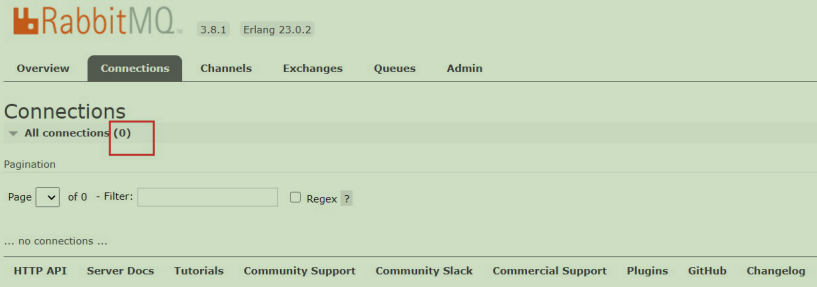

还没有任何连接(Connections) Channels：

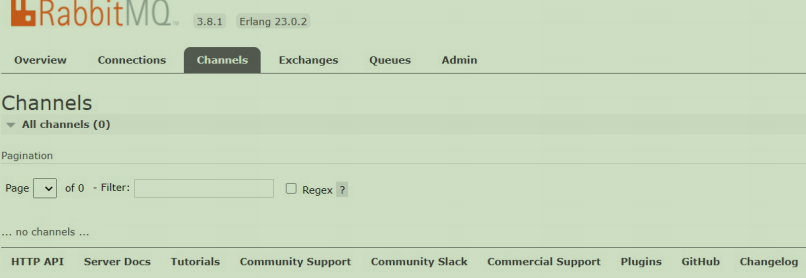

还没有任何通道(Channels) Exchanges：

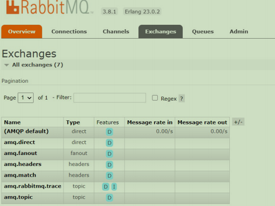

交换机只有系统默认的 Queues：

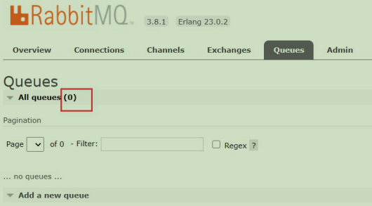

### 1.1 php安装rabbitmq拓展
- 需要先安装依赖库[rabbitmq-c](https://github.com/alanxz/rabbitmq-c)
- 然后下载安装[amqp拓展](http://pecl.php.net/package/amqp)
````
这里准备好了内容
    链接：https://pan.baidu.com/s/1T0nUDqjkPl62-JZHEZfPpg 
    提取码：ui8z
````
````
1.下载安装包(rabbitmq-c)
    wget https://github.com/alanxz/rabbitmq-c/archive/v0.9.0.tar.gz

    tar -zxvf v0.9.0.tar.gz
    
    cd ./rabbitmq-c-0.9.0
    
    mkdir build && cd build

    cd ../

    cmake -DCMAKE_INSTALL_PREFIX=/usr/local

    cmake --build . --target install   #切记 .不要漏掉

    make && make install idconfig #这一步一定要执行，不然php -m 的时候始终提示librabbitmq.so.4 找不到

    #查看rabbitmq是装到lib64还是lib，如果是lib64需要复制一份以lib,避免php -m 的时候始终提示librabbitmq.so.4
    cp -r /usr/local/lib64/* /usr/local/lib

---------------------------------------------------------amqp安装---------------------------------------------------------
    tar -zvxf  amqp-1.10.0.tgz

    cd amqp-1.10.0

    phpize

    find / -name php-config

     ./configure --with-php-config=/www/server/php/73/bin/php-config --with-amqp --with-librabbitmq-dir=/usr/local

    make && make install

    修改php.ini(名字在 /www/server/php/73/lib/php/extensions 中找)
    extension=amqp.so 

    重启php-fpm服务

    [root@localhost local]# php -m | grep amqp
    amqp
````
### 1.2 运行队列
````
--------------------------------------------------mq.php---------------------------------------------------
<?php
//声明连接参数
$config = array(
    'host' => '127.0.0.1',
    //'vhost' => '/' 可能会报错,需要独立创建一个vhost
    'vhost' => 'test',
    'port' => 5672,
    'login' => 'will',
    'password' => '123456'
);

//连接
$cnn = new AMQPConnection($config);if (!$cnn->connect()) {
    echo "Cannot connect to the broker";
    exit();
}

//在连接内创建一个通道
$ch = new AMQPChannel($cnn);

//创建一个交换机
$ex = new AMQPExchange($ch);

//声明路由键
$routingKey = 'key_1';

//声明交换机名称
$exchangeName = 'exchange_1';

//设置交换机名称
$ex->setName($exchangeName);

//设置交换机类型
//AMQP_EX_TYPE_DIRECT:直连交换机
//AMQP_EX_TYPE_FANOUT:扇形交换机
//AMQP_EX_TYPE_HEADERS:头交换机
//AMQP_EX_TYPE_TOPIC:主题交换机
$ex->setType(AMQP_EX_TYPE_DIRECT);

//设置交换机持
$ex->setFlags(AMQP_DURABLE);

//声明交换机
$ex->declareExchange();

//创建一个消息队列
$q = new AMQPQueue($ch);

//设置队列名称
$q->setName('queue_1');

//设置队列持久
$q->setFlags(AMQP_DURABLE);

//声明消息队列
$q->declareQueue();

//交换机和队列通过$routingKey进行绑定
$q->bind($ex->getName(), $routingKey);

//接收消息并进行处理的回调方法
function receive($envelope, $queue) {
    //休眠两秒，
    sleep(1);
    //echo消息内容
    echo $envelope->getBody()."\n";
    //显式确认，队列收到消费者显式确认后，会删除该消息
    $queue->ack($envelope->getDeliveryTag());
}
//设置消息队列消费者回调方法，
$q->consume("receive");
--------------------------------------------------push.php---------------------------------------------------
<?php
$config = array(
    'host' => '127.0.0.1',
    'vhost' => 'test',
    'port' => 5672,
    'login' => 'will',
    'password' => '123456'
);
$cnn = new AMQPConnection($config);
if (!$cnn->connect()) {
    echo "Can't connect to the test";
    exit();
}
$ch = new AMQPChannel($cnn);
$ex = new AMQPExchange($ch);

//消息的路由键，一定要和消费者端一致
$routingKey = 'key_1';

//交换机名称，一定要和消费者端一致，
$exchangeName = 'exchange_1';

$ex->setName($exchangeName);
$ex->setType(AMQP_EX_TYPE_DIRECT);
$ex->setFlags(AMQP_DURABLE);
$ex->declareExchange();
//创建10个消息
for ($i = 1; $i <= 10; $i++) {
//消息内容
    $msg = array(
        'data' => 'message_' . $i,
        'hello' => 'world',
    );
//发送消息到交换机，并返回发送结果
//delivery_mode:2声明消息持久，持久的队列+持久的消息在RabbitMQ重启后才不会丢失
    echo "Send Message:" . $ex->publish(json_encode($msg), $routingKey
            , AMQP_NOPARAM, array('delivery_mode' => 2)) . "\n";
    //代码执行完毕后进程会自动退出
}
---------------------------------------------------注意---------------------------------------------------
建议创建一个新的虚拟主机
    rabbitmqctl add_vhost test
增加远程访问web管理台用户及授权
    rabbitmqctl add_user will 123456                        #增加test用户，密码为123456
    rabbitmqctl set_user_tags will administrator            #添加test角色为 administrator
    rabbitmqctl  set_permissions -p test will '.*' '.*' '.*'   #给test用户授权( )
    rabbitmqctl list_users                                  #查看用户是否已添加
````
先开启消费者创建队列后执行退出

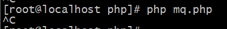

启动生产者,由于生产者不需要阻塞，执行完进程便退出，所以现在RabbitMQ管理界面中既没有Connections也没有Channels，但是Queues已经被Exchanges投递过去了10条消息，如下图：

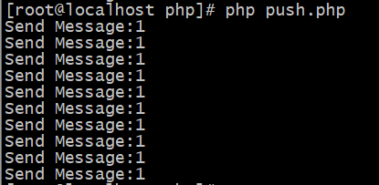

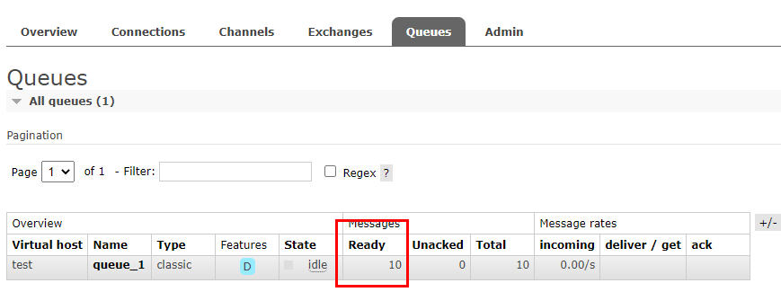

因为我们执行生产者之前已经关掉了消费者，所以此时消息在队列中等待获取; 因为在发送消息时设置了 delivery_mode:2 来声明消息持久化，此时如果重启RabbitMQ，消息还会恢复;此时重新执行消费者，输入``php mq.php``

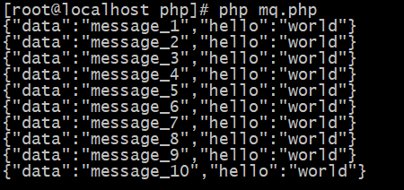

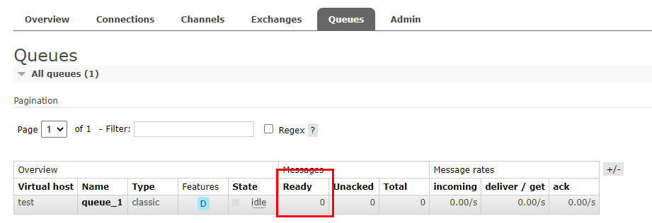

### 1.3 常见问题
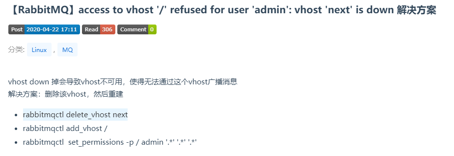

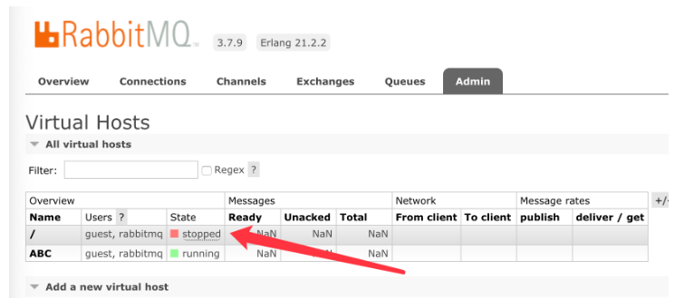

提醒:生产者在生产消息时,如果不存在指定队列,并且没有创建队列,或者队列存在但消息路由键和交换机与队列绑定的键(路由队则)不一致(直连交换机必须一致),则消息会被交换机丢弃