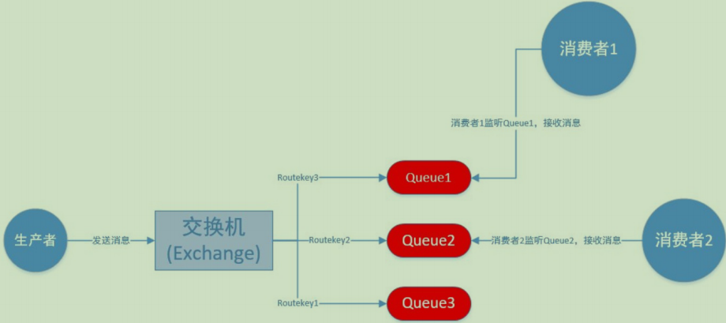
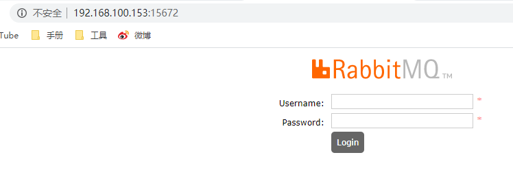
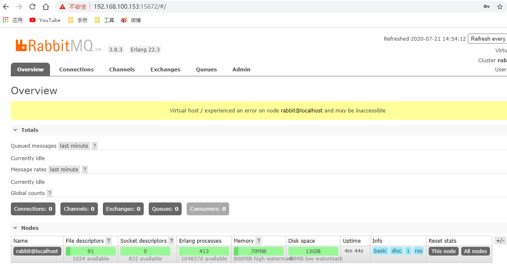
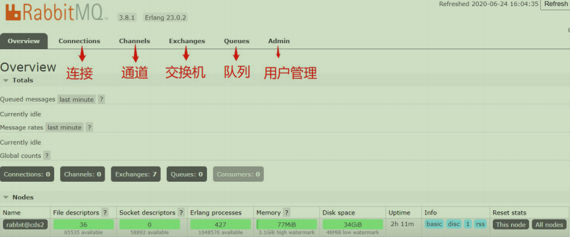

# RabbitMQ基础(一)
## 1.初试RabbitMQ
### 1.1 举例说明
某爸爸要出差了，因为赶时间，家里的事情他没做完，但他又没能联系上你于是他给你留下一张小纸条要你去做，内容是这样的（其实这张小纸条就是一个消息队列),纸条信息为 收碗筷 擦饭桌  拖地,你根据小纸条上面的3条消息，依次做完了这3件事。


>其实这张小纸条就是一个消息队列中间件，我们可以当它是RabbitMQ， 而``某爸爸就是消息的生产者``，``你是消息的消费者``,正如某爸爸（消息生产者）通过小纸条（消息队列）让你（消息消费者）完成了3件事。
>
>程序A（消息生产者）也可以通过RabbitMQ（消息队列） 让其它程序（消息消费者）去做事。
>
>``RabbitMQ实质就是一款消息队列中间件``

## 2.RabbitMQ的诞生和概念
### 2.1 消息队列的由来：：
- 分布式系统已成为当前系统架构的主流, 而消息队列在分布式系统中作为消息中间件，能为分布式系统中各个应用提供会话平台, 比如:连接PHP和java（比如上面这个故事中的爸爸和儿子）。
- 其次，用多进程异步操作取代单进程同步操作, 从而满足高性能系统架构需求。比如爸爸通过消息队列让儿子帮他洗碗，那么爸爸的办事效率是不是高了很多？ 同样的，比如双十一你到淘宝去下个单，可能感到不
卡了，其实淘宝的下单进程已经把很多订单相关逻辑交给其它进程去处理了，那么下单进程就会很快。
- 再其次，可以防止服务器一下子做很多事情。消息队列采用队列的形式，消费者读取队列里面的消息的时候是一条一条读取的，服务器不会超负载。比如上面故事中的儿子，不是 收碗筷 擦饭桌 拖地一起干，而是按着消息队列的顺序一件一件干，这样儿子不会超负载，服务器也是如此。

### 2.2 消息队列的概念:
从上面消息队列的由来，我们可以进一步大致了解下消息队列的概念：
>消息队列中间件是分布式系统中重要的组件，主要解决应用解耦，异步消息，流量削锋等问题，实现高性能，高可用，可伸缩和最终一致性架构。

### 2.3 消息队列的种类：：
>目前使用较多的消息队列有ActiveMQ，RabbitMQ，Redis的list和订阅,ZeroMQ，Kafka，阿里的RocketMQ
## 3.RabbitMQ的AMQP协议 
>RabbitMQ采用了AMQP协议，即Advanced Message Queuing Protocol，一个提供统一消息服务的应用层标准高级消息队列协议，是应用层协议的一个开放标准，为面向消息的中间件设计

图解AMQP协议：


- 生产者（Producer）（见上图中的生产者）：发送消息的应用。
- 消费者（Consumer）（见上图中的消费者）：接收消息的应用。
- 队列（Queue）（见上图中的queue）：存储消息的缓存，一个队列queue存多条消息。
- 消息（Message）：由生产者通过RabbitMQ发送给消费者的信息，消息存储在消息队列queue中。
- 连接（Connection）：连接RabbitMQ和应用服务器的TCP连接（上图中发送消息和接收消息都是必须先建立连接的）。
- 通道（Channel）：连接里的一个虚拟通道。当你通过消息队列发送或者接收消息时，这个操作都是通过通道进行的。
- 交换机（Exchange）（见上图中的交换机）：生产者发送消息是先发到交换机，再由交换机发送到队列里面，并最终保存在队列里面。就好比寄快递，台湾寄到长沙，可能要先寄到上海，那么上海就是这个交换机。
- 绑定（Binding）：绑定是队列和交换机的一个关联连接。
- 路由键（Routing Key）（见上图中的Routing Key）：路由键是供交换机查看并根据键来决定如何分发消息到列队的一个键。路由键可以说是消息的目的地址。
- 用户（Users）：在RabbitMQ里，是可以通过指定的用户名和密码来进行连接的。每个用户可以分配不同的权限，例如读权限，写权限以及在实例里进行配置的权
## 4.RabbitMQ安装和启动
### 4.1 安装erlang环境(RabbitMQ的环境依赖)
````
这里准备好了对应的版本
    链接：https://pan.baidu.com/s/1T0nUDqjkPl62-JZHEZfPpg 
    提取码：ui8z

yum install -y esl-erlang_22.3-1_centos_7_amd64.rpm
yum install -y rabbitmq-server-3.8.3-1.el7.noarch.rpm


启动/关闭程序位置
/usr/lib/rabbitmq/lib/rabbitmq_server-3.8.3/sbin

rabbitmq-server -detached 后台启动(启动后可能查不到端口,稍作等待即可,出现Warning: PID file not written; -detached was passed.不妨碍)
rabbitmq-server   启动
rabbitmqctl stop  停止
rabbitmqctl status  查看状态
rabbitmq-server -v   产看版本
---------------------------------------------------------------------------------------------------------------------------        
启用web管理插件，这样子才能支持浏览器访问rabbitmq   
    rabbitmq-plugins enable rabbitmq_management
--------------------------------------------------------------------------------------------------------------------------- 
设置操作系统字符集utf-8
    vim /etc/profile
    文件末尾加上:
    export LC_ALL=en_US.UTF-8
    然后执行 :
    source /etc/profile
--------------------------------------------------------------------------------------------------------------------------- 
增加远程访问web管理台用户及授权
    rabbitmqctl add_user will 123456 #增加test用户，密码为123456
    rabbitmqctl set_user_tags will administrator #添加test角色为 administrator
    rabbitmqctl set_permissions -p "/" will ".*" ".*" ".*" #给test用户授权( rabbitmqctl  set_permissions -p / will '.*' '.*' '.*')
    rabbitmqctl list_users #查看用户是否已添加
--------------------------------------------------------------------------------------------------------------------------- 
输入ip:15672进行访问
````


管理控制台可以成功访问，那么我们输入用户名密码，点击login，我们成功进入到rabbitmq的浏览器管理页面：


### 4.2 常见报错解决
安装erlang常见报错：
````
执行yum install rabbitmq-server-3.8.1-1.el7.noarch.rpm时，可能报如下错误

提示erlang发生冲突了， 是我们安装erlang之前没有卸载干净之前系统自带的erlang的缘故

解决方法：去卸载干净erlang，然后重新安装erlang
yum list | grep erlang
yum -y remove erlang-*
yum remove erlang.x86_64
rm -rf /usr/lib64/erlang
rm -rf /var/lib/rabbitmq
-----------------------------------------------------------------------------------
rabbitmq安装成功后
检查rabbitmq是否启动或者5672端口是否被占用

安装成功后，在浏览器输入ip:15672后，无法访问
    解决方法：关闭服务器防火墙
    systemctl stop firewalld

    如果是阿里云等第三方的服务器，还需要去后台开开放15672端口
````
# 5.管理控制台使用
我们先来看看管理控制台的登录页面(overview)

