# RabbitMQ高级特性
## 1.ack comfirm机制
### 1.1 什么是Confirm机制
概念：
Pro发送消息到Broker,Broker接收到消息后,产生回送响应 Pro中有一个Confirm Listener异步监听响应应答

步骤：
- 消息的确认 Pro投递消息后,如果Broker收到消息,则会给Pro一个应答
- Pro接收应答 用来确定这条消息是否正常地发送到Broker,该法也是消息可靠性投递的核心保障!
### 1.2 Confirm机制流程图
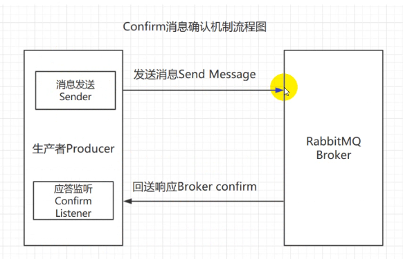

>生产这发送消息后,就会生成一个异步的监听器,监听
RabbitMQ的一个反馈
### 1.3 实现Confirm机制
- 在channel上开启确认模式：$channel->confirm_select();
- 在channel上添加监听：$channel->wait_for_pending_acks();监听成功和失败的返回结果，根据具体的结果对消息进行重新发送、或记录日志等后续处理

````
<?php

use PhpAmqpLib\Connection\AMQPStreamConnection;
use PhpAmqpLib\Exchange\AMQPExchangeType;
use PhpAmqpLib\Message\AMQPMessage;

include(__DIR__ . '/config.php');

$exchange = 'someExchange';

$connection = new AMQPStreamConnection(HOST, PORT, USER, PASS, VHOST);
$channel = $connection->channel();

//保存订单信息到数据库
保存订单信息到数据库的代码; //是否将信息成功推送给消息队列(is_send_succ)


//推送成功
$channel->set_ack_handler(
    function (AMQPMessage $message) {
        //update 订单表 set is_send_succ=ture
        echo "Message acked with content " . $message->body . PHP_EOL;

    }
);

//推送失败
$channel->set_nack_handler(
    function (AMQPMessage $message) {
        //update 订单表 set is_send_succ=false
        echo "Message nacked with content " . $message->body . PHP_EOL;
    }
);

/*
  使频道进入发布确认模式。
  如果在将频道调到该模式之前或之后调用$ch->tx_select（）
  下一次调用$ch->wait（）将导致发布确认模式和事务异常
  相互排斥
 */
$channel->confirm_select();

/*
    姓名：$exchange
    类型：扇形分叉
    passive:false//不检查是否存在同名交换
    持久性：false//服务器重新启动后，exchange将无法生存
    auto_delete:true//关闭通道后，交换将被删除。
*/

$channel->exchange_declare($exchange, AMQPExchangeType::FANOUT, false, false, true);

$i = 1;
$msg = new AMQPMessage($i, array('content_type' => 'text/plain'));
$channel->basic_publish($msg, $exchange);

/*
 通过观察amqp调试输出，您可以看到服务器将使用传递标记1和
 多个标志可能设置为false
 */

$channel->wait_for_pending_acks();

while ($i <= 11) {
    $msg = new AMQPMessage($i++, array('content_type' => 'text/plain'));
    $channel->basic_publish($msg, $exchange);
}

/*
您不必在每次发送邮件后等待挂起的确认。事实上，它会更有效率
等待尽可能多的消息被确认。
 */
$channel->wait_for_pending_acks();

$channel->close();
$connection->close();
````
## 2 保证消息的百分百投递成功
### 2.1 Producer 的可靠性
要求
- 保证消息的成功发出
- 保证MQ节点的成功接收
- 发送端收到MQ节点(Broker) 确认应答
- 完善的消息补偿机制

在实际生产中，很难保障前三点的完全可靠，比如在极端的环境中，生产者发送消息失败了，发送端在接受确认应答时突然发生网络闪断等等情况，很难保障可靠性投递，所以就需要有第四点完善的消息补偿机制。
### 2.2 解决方案
#### 2.2.1 方案一:消息信息落库,对消息状态进行打标(常见方案)
将消息持久化到DB并设置状态值,收到Consumer的应答就改变当前记录的状态.再轮询重新发送没接收到应答的消息,注意这里要设置重试次数

#### 方案流程图
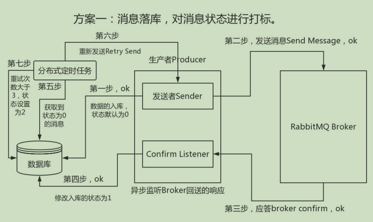
#### 方案实现流程
比如我下单成功
- step1 - 对订单数据入BIZ DB订单库,并对因此生成的业务消息入MSG DB消息库,此处由于采用了两个数据库,需要两次持久化操作,为了保证数据的一致性,有人可能就想着采用分布式事务,但在大厂实践中,基本都是采用补偿机制!
````
这里一定要保证step1 中消息都存储成功了，没有出现任何异常情况，然后生产端再进行消息发送。如果失败了就进行快速失败机制
````
对业务数据和消息入库完毕就进入
- setp2 - 发送消息到 MQ 服务上，如果一切正常无误消费者监听到该消息，进入
- step3 - 生产端有一个 Confirm Listener ,异步监听Broker回送的响应,从而判断消息是否投递成功
- step4 - 如果成功,去数据库查询该消息,并将消息状态更新为1
- step5 - 如果出现意外情况，消费者未接收到或者 Listener 接收确认时发生网络闪断，导致生产端的Listener就永远收不到这条消息的confirm应答了，也就是说这条消息的状态就一直为0了，这时候就需要用到我们的,分布式定时任务来从 MSG 数据库抓取那些超时了还未被消费的消息，重新发送一遍 此时我们需要设置一个规则，比如说消息在入库时候设置一个临界值timeout，5分钟之后如果还是0的状态那就需要把消息抽取出来。这里我们使用的是分布式定时任务，去定时抓取DB中距离消息创建时间超过5分钟的且状态为0的消息。
- step6 - 把抓取出来的消息进行重新投递(Retry Send)，也就是从第二步开始继续往下走
- step7 - 当然有些消息可能就是由于一些实际的问题无法路由到Broker，比如routingKey设置不对，对应的队列被误删除了，那么这种消息即使重试多次也仍然无法投递成功，所以需要对重试次数做限制，比如限制3次，如果投递次数大于三次，那么就将消息状态更新为2，表示这个消息最终投递失败,然后通过补偿机制，人工去处理。实际生产中，这种情况还是比较少的，但是你不能没有这个补偿机制，要不然就做不到可靠性了。

>总结:就是在ack机制上将发送失败的消息记录在数据库中,待连接正常后进行3~2次的重新发送,确保每一条消息都能都够得到发送
#### 2.2.2 方案二:消息的延迟投递，做二次确认，回调检查（不常用，大厂在用的高并发方案）
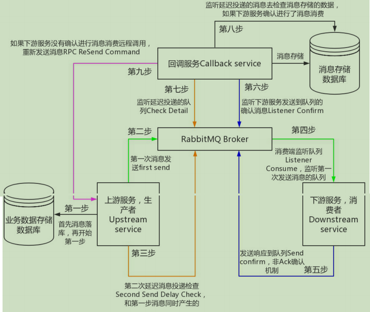

- 第一步：（上游服务：Upstream service）业务入库 然后send 消息到broker这两步是有先后顺序的然后再
- 第二步进行消息延迟发送到新的queue（延迟时间为5分钟：业务决定）
- 第三步（下游服务：Downstream service）监听到消息然后处理消息
- 第四步 下游服务send confirm生成新的消息到broker （这里是一个新的queue）
- 第五步 callback service 去监听这个消息 并且入库 如果监听到表示这个消息已经消费成功第六步 callback service 去检查 第二步投递的延迟消息是否 在msgDB里面是否消费成功，不存在或者消费失败就会 Resend command如果在第1,2,4步失败 ，如果成功 broker会给我们一个confirm，失败当然没有，这是消息可靠性投递的重要

>总结第二种设计模式与第一中的区别就是消费者在消费完成后将信息再次发送给消息队列,由数据库对信息进行消费,存储至数据库,那么在数据库中拥有的信息一定是经过了消费者消费的,这样就确保了每一条消息百分之百的消费

## 3.幂等级
### 3.1 什么是幂等性
简单理解:用户对于同一操作发起的一次请求或者多次请求的结果是一致的

比如数据库的乐观锁,在执行更新操作前,先去数据库查询version,然后执行更新语句,以version作为条件,如果执行更新时有其他人先更新了这张表的数据,那么这个条件就不生效了,也就不会执行操作了,通过这种乐观锁的机制来保障幂等性.
### 3.2 Con - 幂等性
在业务高峰期最容易产生消息重复消费问题,当Con消费完消息时,在给Pro返回ack时由于网络中断,导致Pro未收到确认信息,该条消息就会重新发送并被Con消费,但实际上该消费者已成功消费了该条消息,这就造成了重复消费.

而Con - 幂等性,即消息不会被多次消费,即使我们收到了很多一样的消息
### 3.3 主流幂等性实现方案
唯一ID+指纹码

核心:利用数据库主键去重
- 唯一ID:业务表的主键
- 指纹码：为了区别每次正常操作的码，每次操作时生成指纹码；可以用时间戳+业务编号或者标志位（具体视业务场景而定）


优势 
- 实现简单
弊端 
- 高并发下有数据库写入的性能瓶颈
>解决方案 根据ID进行分库分表算法路由

小结
>首先我们需要根据消息生成一个全局唯一ID，然后还需要加上一个指纹码。这个指纹码它并不一定是系统去生成的，而是一些外部的规则或者内部的业务规则去拼接，它的目的就是为了保障这次操作是绝对唯一的。将ID + 指纹码拼接好的值作为数据库主键，就可以进行去重了。即在消费消息前呢，先去数据库查询这条消息的指纹码标识是否存在，没有就执行insert操作，如果有就代表已经被消费了，就不需要管了
## 4 Return机制
### 4.1 什么是Return机制
Return Listener用于处理一些不可路由的消息。也是生产段添加的一个监听。

我们的消息生产者，通过指定一个Exchange和Routingkey，把消息送达到某一个队列中去，然后我们的消费者监听队列，进行消息处理操作。但是在某些情况下，如果我们在发送消息的时候，当前的exchange不存在或者指定的路由key路由找不到，这个时候如果我们需要监听这种不可达的消息，就要使用Return Listener。
### 4.2 图解Return机制
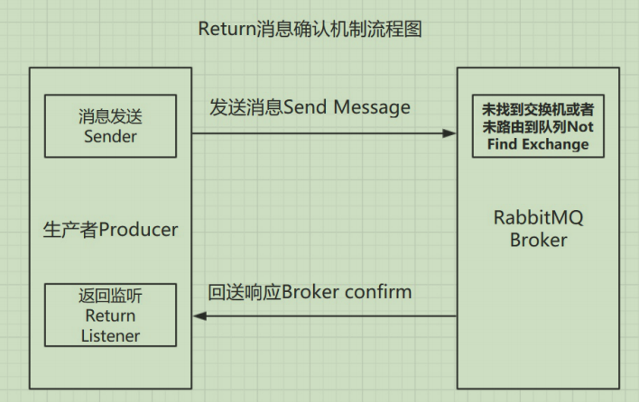
### 4.3 实现Return机制
````
<?php
require_once __DIR__ . '/../vendor/autoload.php';
use PhpAmqpLib\Connection\AMQPStreamConnection;
use PhpAmqpLib\Exchange\AMQPExchangeType;
use PhpAmqpLib\Message\AMQPMessage;

$connection = new AMQPStreamConnection('localhost', 5672, 'will', '123456','test');
$channel = $connection->channel();

$channel->exchange_declare('hidden_exchange', AMQPExchangeType::TOPIC);

$message = new AMQPMessage("Hello World!");

//这里是我们手动添加的报错信息
//echo " [x] Sent non-mandatory ...";

while ($wait) {
    $channel->wait();
}
$channel->close();
$connection->close();
````
>当生产者找不到交换机的时候,rabbitmq是不会报错的,这也就是我们应用return机制的原因,这里解决办法就是加入监听器
````
<?php
require_once __DIR__ . '/../vendor/autoload.php';
use PhpAmqpLib\Connection\AMQPStreamConnection;
use PhpAmqpLib\Exchange\AMQPExchangeType;
use PhpAmqpLib\Message\AMQPMessage;

$connection = new AMQPStreamConnection('localhost', 5672, 'will', '123456','test');
$channel = $connection->channel();

//这里设置了一个不存在的交换价
$channel->exchange_declare('hidden_exchange', AMQPExchangeType::TOPIC);

$message = new AMQPMessage("Hello World!");


//设置一个属性
$wait = true;
//监听器的开始
$returnListener = function (
    //错误码
    $replyCode,
    //错误信息
    $replyText,
    //交换器
    $exchange,
    //key值
    $routingKey,
    $message
) use ($wait) {
    //返回rabbitmq的消息
    $GLOBALS['wait'] = false;
    echo "return: ",
    $replyCode, "\n",
    $replyText, "\n",
    $exchange, "\n",
    $routingKey, "\n",
    $message->body, "\n";
};
//设置这个监听器
$channel->set_return_listener($returnListener);

//这里是我们手动输出的报错内容
//echo " [x] Sent mandatory ... ";

$channel->basic_publish(
    $message,
    'hidden_exchange',
    'rkey',
    //这个参数必不可少
    true
);


echo " done.\n";
while ($wait) {
    $channel->wait();
}
$channel->close();
$connection->close();
-----------------------------------------结果-----------------------------------------
[root@localhost demo]# php basic_return_noReturn.php
 done.
return: 312
NO_ROUTE  //这里报错的原因是因为没有绑定任何路由键
hidden_exchange
rkey
Hello World!
````
## 5 限流机制
### 5.1 Con - 限流机制
为何要限流：
- 假设我们有这样的场景 Rabbitmq服务器有上万条未处理的消息,我们随便打开一个Con - Client,会造成:巨量的消息瞬间全部推送过来,然而我们单个客户端无法同时处理这么多数据!此时很有可能导致服务器崩溃，严重的可能导致线上的故障。
- 还有一些其他的场景，比如说单个Pro一分钟产生了几百条数据,但是单个Con一分钟可能只能处理60条,这个时候Pro-Con肯定是不平衡的。通常Pro是没办法做限制的。所以Con肯定需要做一些限流措施，否则如果超出最大负载，可能导致Con性能下降，服务器卡顿甚至崩溃等一系列严重后果

RabbitMQ提供了一种qos (服务质量保证)功能,即在非自动确认消息的前提下,如果一定数目的消息 (通过基于Con或者channel设置Qos的值) 未被确认前,不消费新的消息
>不能设置自动签收功能(autoAck = false) 如果消息未被确认,就不会到达Con,目的就是给Pro减压
#### 限流设置API
>$channel->basic_qos($prefetchSize, 20, $global);
>
>这行代码放置在消费者页面执行,代表一次只能消费20条消息
- prefetchSize: 单条消息的大小限制，Con通常设置为0，表示不做限制
- prefetchCount: 一次最多能处理多少条消息
- global: 是否将上面设置true应用于channel级别还是取false代表Con级别
>prefetchSize和global这两项,RabbitMQ没有实现,暂且不研究 prefetchCount在 autoAck=false 的情况下生效,即在自动应答的情况下该值无效

手工ACK
>$message->delivery_info['channel']->basic_ack($message->delivery_info['delivery_tag']);
>
>这行代码执行在消费中,通过手动的ack机制告诉rabbitmq消息是否被消费

调用这个方法就会主动回送给Broker一个应答，表示这条消息我处理完了，你可以给我下一条了。参数multiple表示是否批量签收，由于我们是一次处理一条消息，所以设置为false
### 5.2 实现
````
<?php

include(__DIR__ . '/config.php');
use PhpAmqpLib\Connection\AMQPStreamConnection;

$connection = new AMQPStreamConnection(HOST, PORT, USER, PASS, VHOST);

$channel = $connection->channel();

//直接生成一个名为qos_queue的消息队列
$channel->queue_declare('qos_queue', false, true, false, false);

//第二个参数代表：每次只消费1条
$channel->basic_qos(null, 1, null);

function process_message($message)
{
    //消费完消息之后进行应答，告诉rabbit我已经消费了，可以发送下一组了
    //如果注释了者一行,那么消费者就没有回信给rabbitmq,那么消息一直都只是被消费了一条
    $message->delivery_info['channel']->basic_ack($message->delivery_info['delivery_tag']);
}

$channel->basic_consume('qos_queue', '', false, false, false, false, 'process_message');

while ($channel->is_consuming()) {
    // After 10 seconds there will be a timeout exception.
    $channel->wait(null, false, 30000);
}
````
- 先运行代码生成了消息队列qos_queue

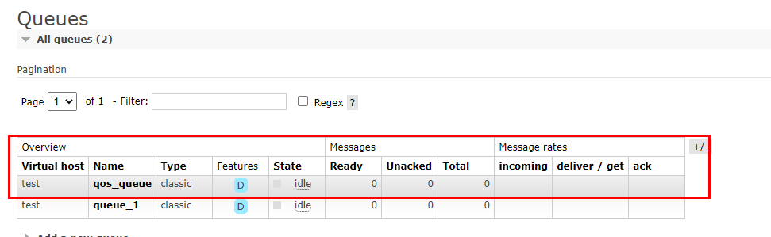

- 手动向该消息队列中添加若干消息

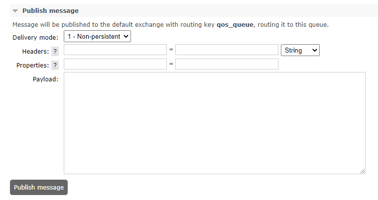
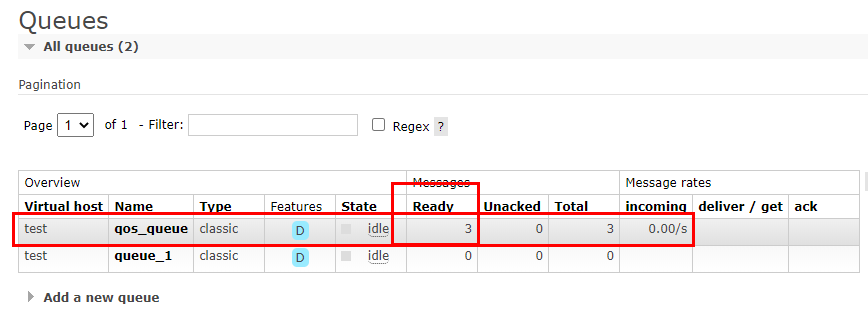

- 注释了``$message->delivery_info['channel']->basic_ack($message->delivery_info['delivery_tag']);``

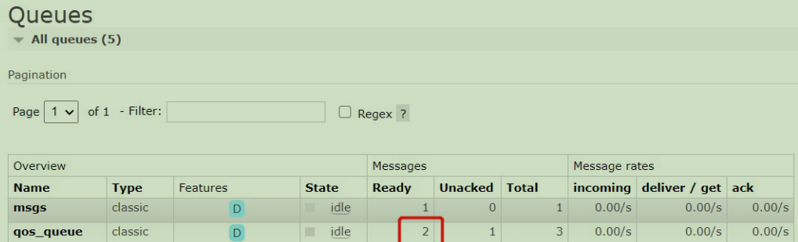

- 现在,我们开启ACK应答处理 ，把之前注释掉的那行代码，重新打开，如下图

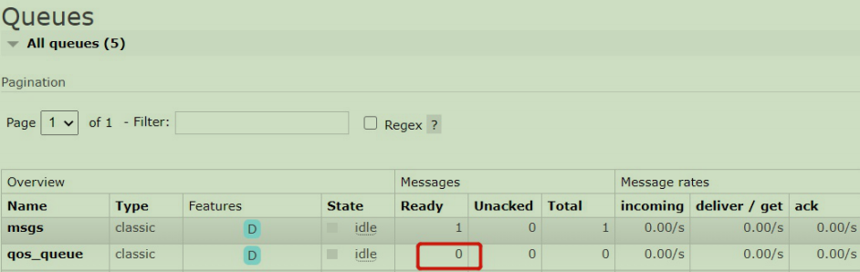

## 6.Con - ACK & 重回队列机制
### 6.1 ACK & NACK
当我们设置``autoACK=false``时,就可以使用手工ACK方式了,其实手工方式包括了手工ACK与NACK 当我们手工 ACK 时,会发送给Broker一个应答,代表消息处理成功,Broker就可回送响应给Pro. NACK 则表示消息处理失败,如果设置了重回队列,Broker端就会将没有成功处理的消息重新发送
#### 使用方式
- Con消费时,如果由于业务异常,我们可以手工 NACK 记录日志,然后进行补偿API：void basicNack(long deliveryTag, boolean multiple, boolean requeue)API：void basicAck(long deliveryTag, boolean multiple) 
- 如果由于服务器宕机等严重问题,我们就需要手工 ACK 保障Con消费成功
### 6.2 重回队列
- 重回队列是为了对没有处理成功的消息,将消息重新投递给Broker 
- 重回队列,会把消费失败的消息重新添加到队列的尾端,供Con继续消费
- 一般在实际应用中,都会关闭重回队列,即设置为false
### 6.3 实现机制
>核心就是``$message->nack(true);``
````
<?php
/**
    通过调用php demo/basic在一个窗口中启动这个basic_nack.php
    然后在一个单独的窗口中发布一条消息：php demo/amqp_publisher.php好的
    那个信息应该被“确认”
    Then publish a message like this: php demo/amqp_publisher.php bad
    that message should be "nack'ed"
 */
include(__DIR__ . '/config.php');
use PhpAmqpLib\Connection\AMQPStreamConnection;
use PhpAmqpLib\Exchange\AMQPExchangeType;

//执行代码自动生成交换机router队列msgs
$exchange = 'router';
$queue = 'msgs';
$consumerTag = 'consumer';

$connection = new AMQPStreamConnection(HOST, PORT, USER, PASS, VHOST);
$channel = $connection->channel();

$channel->queue_declare($queue, false, true, false, false);
$channel->exchange_declare($exchange, AMQPExchangeType::DIRECT, false, true, false);
$channel->queue_bind($queue, $exchange);

/**
 * @param \PhpAmqpLib\Message\AMQPMessage $message
 */
function process_message($message)
{
    if ($message->body == 'good') {
        $message->ack();
    } else {
        echo "成功收到消息，消息内容为：".$message->body ;
        echo "将消息打回,重回队列：";

        //这行代码就是将消息重新发送回rabbitmq
        $message->nack(true);
    }

    // Send a message with the string "quit" to cancel the consumer.
    if ($message->body === 'quit') {
        $message->getChannel()->basic_cancel($message->getConsumerTag());
    }
}

$channel->basic_consume($queue, $consumerTag, false, false, false, false, 'process_message');

/**
 * @param \PhpAmqpLib\Channel\AMQPChannel $channel
 * @param \PhpAmqpLib\Connection\AbstractConnection $connection
 */
function shutdown($channel, $connection)
{
    $channel->close();
    $connection->close();
}

register_shutdown_function('shutdown', $channel, $connection);

// Loop as long as the channel has callbacks registered
while ($channel->is_consuming()) {
    $channel->wait();
}
````
>先执行代码.生成消息队列``msgs``,停止代码运行,进行数据的插入
>
>当插入消息为``good``的时候正常消费,但是当插入消息为非``good``时候,被全部打回值消息队列

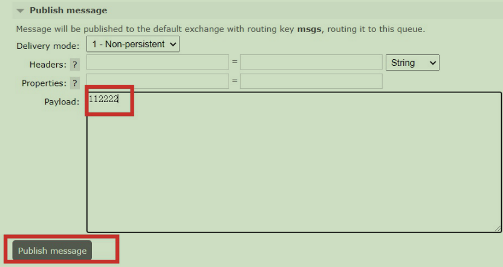
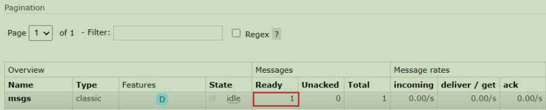
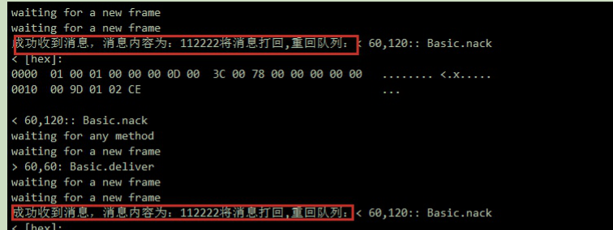

>循环接收的原因：这条消息由于我们调用了NACK，并且设置了重回队列（如下图对代码的讲解所示）所以会导致该条消息一直重复发送，消费端就会一直循环消费
## 7.TTL
### 7.1 什么是TTL
- TTL(Time To Live),即生存时间
- RabbitMQ支持消息的过期时间，在消息发送时可以进行指定
- RabbitMQ支持为每个队列设置消息的超时时间，从消息入队列开始计算，只要超过了队列的超时时间配置，那么消息会被自动清除
### 7.2 实现TTL
核新代码
````
// 消息过期方式：设置 queue.normal 队列中的消息10s之后过期
$args->set('x-message-ttl', 10000);
````
### 7.3实操演示
````
<?php
include(__DIR__ . '/config.php');
use PhpAmqpLib\Wire\AMQPTable;
use PhpAmqpLib\Message\AMQPMessage;
use PhpAmqpLib\Exchange\AMQPExchangeType;
use PhpAmqpLib\Connection\AMQPStreamConnection;

/**
 * 死信队列测试
 * 1、创建两个交换器 exchange.normal 和 exchange.dlx, 分别绑定两个队列 queue.normal 和 queue.dlx
 * 2、把 queue.normal 队列里面的消息配置过期时间，然后通过 x-dead-letter-exchange 指定死信交换器为 exchange.dlx
 * 3、发送消息到 queue.normal 中，消息过期之后流入 exchange.dlx，然后路由到 queue.dlx 队列中，进行消费
 */

// todo 更改配置
//$connection = new AMQPStreamConnection('192.168.33.1', 5672, 'zhangcs', 'zhangcs', '/');
$connection = new AMQPStreamConnection(HOST, PORT, USER, PASS, VHOST);

$channel = $connection->channel();

$channel->exchange_declare('exchange.dlx', AMQPExchangeType::DIRECT, false, true);
$channel->exchange_declare('exchange.normal', AMQPExchangeType::FANOUT, false, true);
$args = new AMQPTable();
// 消息过期方式：设置 queue.normal 队列中的消息10s之后过期
$args->set('x-message-ttl', 10000);
// 设置队列最大长度方式： x-max-length
//$args->set('x-max-length', 1);
$args->set('x-dead-letter-exchange', 'exchange.dlx');
$args->set('x-dead-letter-routing-key', 'routingkey');
$channel->queue_declare('queue.normal', false, true, false, false, false, $args);
$channel->queue_declare('queue.dlx', false, true, false, false);

$channel->queue_bind('queue.normal', 'exchange.normal');
$channel->queue_bind('queue.dlx', 'exchange.dlx', 'routingkey');
$message = new AMQPMessage('Hello DLX Message');
$channel->basic_publish($message, 'exchange.normal', 'rk');

$channel->close();
$connection->close();
````
立马打开管控台，可以看到生成了1条消息

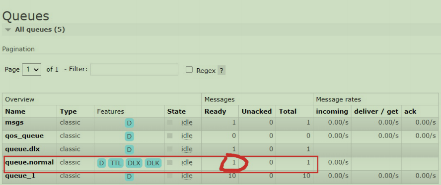

10秒后，发现消息不见了

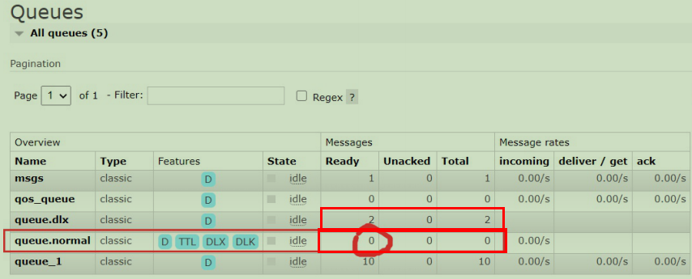
## 8 死信队列(回收站队列)
### 8.1 什么是死信队列
DLX - 死信队列(dead-letter-exchange) 利用DLX,当消息在一个队列中变成死信 (dead message) 之后,它能被重新publish到另一个Exchange中,这个Exchange就是DLX.
### 8.2 死信队列的产生场景
消息被拒绝(basic.reject / basic.nack),并且requeue = false 消息因TTL过期 队列达到最大长度
### 8.3 死信的处理过程
DLX亦为一个普通的Exchange,它能在任何队列上被指定,实际上就是设置某个队列的属性 当某队列中有死信时,RabbitMQ会自动地将该消息重新发布到设置的Exchange,进而被路由到另一个队列 可以监听这个队列中的消息做相应的处理.该特性可以弥补RabbitMQ 3.0以前支持的immediate参数的功能
### 8.4 死信队列的配置
设置死信队列的exchange和queue,然后进行绑定 - Exchange:dlx.exchange - Queue: dlx.queue - RoutingKey:# 正常声明交换机、队列、绑定，只不过我们需要在队列加上一个参数即可arguments.put(" x-dead-letterexchange"，"dlx.exchange");
这样消息在过期、requeue、 队列在达到最大长度时，消息就可以直接路由到死信队列！
### 8.5 实操演示
````
<?php
include(__DIR__ . '/config.php');
use PhpAmqpLib\Wire\AMQPTable;
use PhpAmqpLib\Message\AMQPMessage;
use PhpAmqpLib\Exchange\AMQPExchangeType;
use PhpAmqpLib\Connection\AMQPStreamConnection;
/**
- 死信队列测试
- 1、创建两个交换器 exchange.normal 和 exchange.dlx, 分别绑定两个队列 queue.normal 和 queue.dlx
- 2、把 queue.normal 队列里面的消息配置过期时间，然后通过 x-dead-letter-exchange 指定死信交换器为 exchange.dlx
- 3、发送消息到 queue.normal 中，消息过期之后流入 exchange.dlx，然后路由到 queue.dlx 队列中，进行消费
*/

// todo 更改配置
//$connection = new AMQPStreamConnection('192.168.33.1', 5672, 'zhangcs', 'zhangcs', '/');

$connection = new AMQPStreamConnection(HOST, PORT, USER, PASS, VHOST);

$channel = $connection->channel();

$channel->exchange_declare('exchange.dlx', AMQPExchangeType::DIRECT, false, true);

$channel->exchange_declare('exchange.normal', AMQPExchangeType::FANOUT, false, true);

$args = new AMQPTable();

// 消息过期方式：设置 queue.normal 队列中的消息10s之后过期
$args->set('x-message-ttl', 10000);

// 设置队列最大长度方式： x-max-length
//$args->set('x-max-length', 1);
//设置私信队列,参数x-dead-letter-exchange与x-dead-letter-routing-key是写死的
//死信队列的交换机
$args->set('x-dead-letter-exchange', 'exchange.dlx');
//死信队列的路由键
$args->set('x-dead-letter-routing-key', 'routingkey');

$channel->queue_declare('queue.normal', false, true, false, false, false, $args);
$channel->queue_declare('queue.dlx', false, true, false, false);

$channel->queue_bind('queue.normal', 'exchange.normal');

$channel->queue_bind('queue.dlx', 'exchange.dlx', 'routingkey');

$message = new AMQPMessage('Hello DLX Message');

$channel->basic_publish($message, 'exchange.normal', 'rk');

$channel->close();
$connection->close();
````


