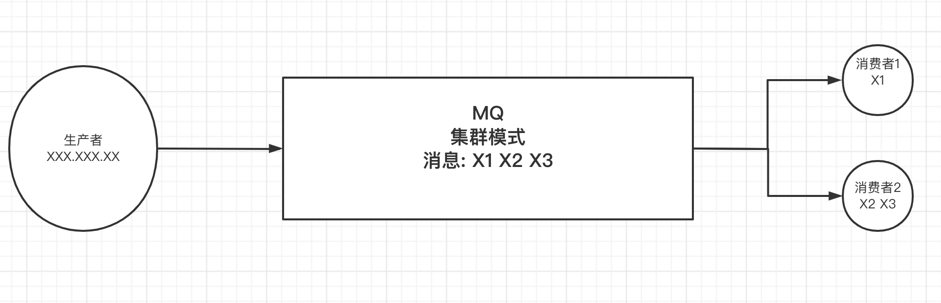
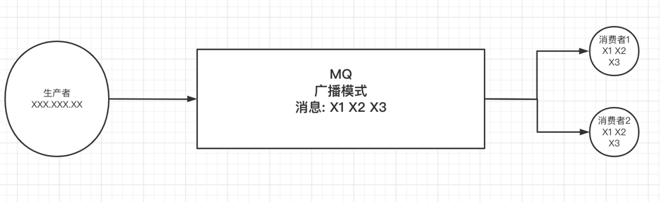

## 广播消息
RocketMQ的消费者消费消息，有2种模式：
- 负载均衡模式(集群模式)



- 广播模式


```go
RocketmqPushConsumerClient, err = rocketmq.NewPushConsumer(
    consumer.WithNameServer(rocket.Host),
    consumer.WithConsumerModel(consumer.Clustering), // 设置接受消息的模式 -BroadCasting： 广播模式    -Clustering：集群模式
    consumer.WithGroupName("rocketTest"),

    //consumer.WithConsumerOrder(true), // 设置消费者局部消费有序
)
````