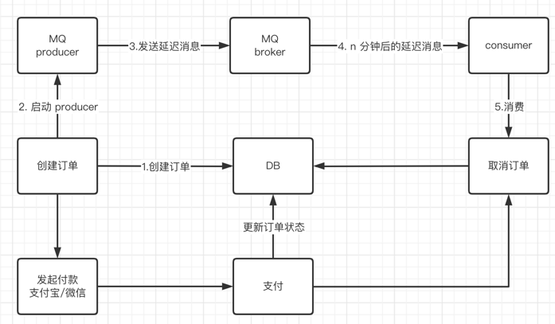

## 延迟消息
在电商中，下单后，有一些用户付款后，会主动退款。也有一些用户下单后，未付款。但是这部分未付款的订单，会占用着商品库存。
我们可以给出如下的解决方案：
> 启动一个定时任务，每30分钟，定时扫描一遍订单表， 如果订单是已付款，则跳过，不处理， 如果订单是未付款，但未超过30分钟，不处理， 如果订单是未付款，且超过30分钟，就取消订单 (补充：取消订单，其实就是下单的逆向流程)

但是这种方式存在一定的缺陷：
- 每次定时任务去扫描全部订单，但是订单未付款且超时30分钟的只有一小部分。就是做很多无用功。
- 如果订单表的数量超级超级大，这个时候，扫描的时间巨长，浪费cpu资源。
- 这样子频繁查询数据库，给数据库造成很多不必要的压力。

这个时候 RocketMQ 的延时消息登场了：



> 创建订单的时候，发送一条延时30分钟的消息。到30分钟后，消费者拿到信息，再去判断订单是否已付款，如果付款就跳过不处理，没付款，那就取消订单

### 代码
```go
for i := 0; i < len(data); i++ {
		value := v.Index(i) // Value of item
		infoByte, _ := json.Marshal(value.Interface())

		msg := &primitive.Message{
			Topic: _const.Topic,
			Body:  infoByte,
			Queue: &primitive.MessageQueue{
				Topic:      _const.Topic,
				BrokerName: _const.BrokerName,
				QueueId:    2,
			},
		}
		msg.WithDelayTimeLevel(3)  // 设置延迟级别
		sendData = append(sendData, msg)
	}
````
**MQ** 默认有几个延迟级别：
````
messageDelayLevel = 1s 5s 10s 30s 30s 1m 2m 3m 4m 5m 6m 7m 8m 9m 10m 20m 30m 1h 2h
msg.setDelayTimeLevel(3);  // 表示延迟 10s 执行
````
### 原理
- 生产者发送的消息，因为带了延迟级别，因此会被分发到叫SCHEDULE_TOPIC_XXXX的Topic中。里面有18的队列，一个队列对应着一个延迟级别。比如queueId=delayLevel-1。
```java
//真正的topic
String topic = msg.getTopic();
//真正的队列Id
int queueId = msg.getQueueId();

final int tranType = MessageSysFlag.getTransactionValue(msg.getSysFlag());
if (tranType == MessageSysFlag.TRANSACTION_NOT_TYPE
    || tranType == MessageSysFlag.TRANSACTION_COMMIT_TYPE) {
    // 延迟级别大于0
    if (msg.getDelayTimeLevel() > 0) {
        // 如果延迟级别大于最大延迟级别，那就把延迟级别设置为最大延迟级别
        if (msg.getDelayTimeLevel() > this.defaultMessageStore.getScheduleMessageService().getMaxDelayLevel()) {
            msg.setDelayTimeLevel(this.defaultMessageStore.getScheduleMessageService().getMaxDelayLevel());
        }
        // 延迟topicSCHEDULE_TOPIC_XXXX
        topic = TopicValidator.RMQ_SYS_SCHEDULE_TOPIC;
        // 根据延迟级别，获取队列id
        queueId = ScheduleMessageService.delayLevel2QueueId(msg.getDelayTimeLevel());

        // Backup real topic, queueId
        MessageAccessor.putProperty(msg, MessageConst.PROPERTY_REAL_TOPIC, msg.getTopic());
        MessageAccessor.putProperty(msg, MessageConst.PROPERTY_REAL_QUEUE_ID, String.valueOf(msg.getQueueId()));
        msg.setPropertiesString(MessageDecoder.messageProperties2String(msg.getProperties()));
        // 消息的topic设置为延迟topic，不是设置真正的topic
        msg.setTopic(topic);
        msg.setQueueId(queueId);
    }
}

省略部分封装msg的代码..
    //最后把msg追加到mappedFile上，mappedFile这个后续再讲，在这里你把它当做一个文件即可
    result = mappedFile.appendMessage(msg, this.appendMessageCallback);
````
定时器，每100毫秒，扫描所有延迟级别里面的延迟消息message，如果消费时间已经大于当前时间，那定时器就会把延迟消息message，发送到真正的topic（就是代码写的topic，比如上面代码的:delayTopic），根据负载均衡策略，把message发送到具体某个队列。
````
public void start() {
        //通过AtomicBoolean 来确保 有且仅有一次执行start方法
        if (started.compareAndSet(false, true)) {
            this.timer = new Timer("ScheduleMessageTimerThread", true);
            // 遍历所有 延迟级别
            for (Map.Entry<Integer, Long> entry : this.delayLevelTable.entrySet()) {
                // key为延迟级别
                Integer level = entry.getKey();
                // value 为 毫秒数
                Long timeDelay = entry.getValue();
                // 根据延迟级别 ，获取对应的offset
                Long offset = this.offsetTable.get(level);
                //
                if (null == offset) {
                    offset = 0L;
                }
                // 为每个延迟级别创建定时任务，开始执行定时任务，1S后开始执行
                if (timeDelay != null) {
                    // 第二步：具体核心执行逻辑在DeliverDelayedMessageTimerTask-->executeOnTimeup()
                    this.timer.schedule(new DeliverDelayedMessageTimerTask(level, offset), FIRST_DELAY_TIME);
                }
            }
            // 延迟10秒后执行定时任务，flushDelayOffsetInterval=10s,周期也是10秒执行一次
            this.timer.scheduleAtFixedRate(new TimerTask() {

                @Override
                public void run() {
                    try {
                        //持久化每个队列的消费offset
                        if (started.get()) ScheduleMessageService.this.persist();
                    } catch (Throwable e) {
                        log.error("scheduleAtFixedRate flush exception", e);
                    }
                }
            }, 10000, this.defaultMessageStore.getMessageStoreConfig().getFlushDelayOffsetInterval());
        }
    }
````
````
public void executeOnTimeup() {
            //根据延迟级别和topic:RMQ_SYS_SCHEDULE_TOPIC = "SCHEDULE_TOPIC_XXXX";来找到对应的ConsumeQueue
            ConsumeQueue cq =
                ScheduleMessageService.this.defaultMessageStore.findConsumeQueue(TopicValidator.RMQ_SYS_SCHEDULE_TOPIC,
                    delayLevel2QueueId(delayLevel));
            // 消费偏移量
            long failScheduleOffset = offset;

            if (cq != null) {
                // 根据消费偏移量从消息队列中获取所有有效消息
                SelectMappedBufferResult bufferCQ = cq.getIndexBuffer(this.offset);
                if (bufferCQ != null) {
                    try {
                        long nextOffset = offset;
                        int i = 0;
                        ConsumeQueueExt.CqExtUnit cqExtUnit = new ConsumeQueueExt.CqExtUnit();
                        // 遍历所有消息
                        for (; i < bufferCQ.getSize(); i += ConsumeQueue.CQ_STORE_UNIT_SIZE) {
                            // 获取消息的物理偏移量
                            long offsetPy = bufferCQ.getByteBuffer().getLong();
                            // 获取消息的物理长度
                            int sizePy = bufferCQ.getByteBuffer().getInt();
                            long tagsCode = bufferCQ.getByteBuffer().getLong();

                          
                            //当前时间
                            long now = System.currentTimeMillis();
                            //消费时间
                            long deliverTimestamp = this.correctDeliverTimestamp(now, tagsCode);
                            //下一个偏移量
                            nextOffset = offset + (i / ConsumeQueue.CQ_STORE_UNIT_SIZE);
                            //如果消费时间<当前时间，说明应该被消费了
                            long countdown = deliverTimestamp - now;

                            if (countdown <= 0) {
                                //根据物理偏移量和长度，获取消息
            MessageExt msgExt = ScheduleMessageService.this.defaultMessageStore.lookMessageByOffset(offsetPy, sizePy);

                            if (msgExt != null) {
                                try {
                                    //构建真正 的消息
                                    MessageExtBrokerInner msgInner = this.messageTimeup(msgExt);
                                    
                                    // 重新把消息发送到真正的消息队列上
                                    PutMessageResult putMessageResult =
                                        ScheduleMessageService.this.writeMessageStore
                                            .putMessage(msgInner);
                              ...省略一堆不太重要的代码
                            }
            //这里又重新添加一个新的任务，这次是100毫秒
            ScheduleMessageService.this.timer.schedule(new DeliverDelayedMessageTimerTask(this.delayLevel, failScheduleOffset), DELAY_FOR_A_WHILE);
        }

````
有消息后，消费者进行消息和后续处理....