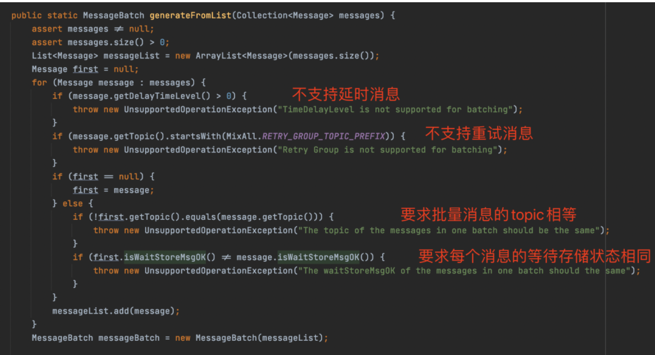

## 批量消息
> 批量消息是指将多条消息合并成一个批量消息，一次发送出去。这样的好处是可以减小网终 I/O 担升吞吐量。

**批量发送的注意点**：
- 需要同一个topic才能一起批量发送
- 不能发送延时消息
- 不能发送重试消息
- 不能发送一个超过 1MB 的批量消息(4.7.1 后是 4M 限制)



```go
func main() {
	p, _ := rocketmq.NewProducer(
		producer.WithNsResolver(primitive.NewPassthroughResolver([]string{"127.0.0.1:9876"})),
		producer.WithRetry(2),
	)
	err := p.Start()
	if err != nil {
		fmt.Printf("start producer error: %s", err.Error())
		os.Exit(1)
	}
	var msgs []*primitive.Message
	for i := 0; i < 10; i++ {
		msgs = append(msgs, primitive.NewMessage("test",
			[]byte("Hello RocketMQ Go Client! num: "+strconv.Itoa(i))))
	}

	res, err := p.SendSync(context.Background(), msgs...)

	if err != nil {
		fmt.Printf("send message error: %s\n", err)
	} else {
		fmt.Printf("send message success: result=%s\n", res.String())
	}
	err = p.Shutdown()
	if err != nil {
		fmt.Printf("shutdown producer error: %s", err.Error())
	}
}
````
### 如果消息超过了 4M 怎么办
如果超出了 4M 会报出错误
````
Exception in thread "main" org. apache.rocketmq.client.exception.MQClientException：CODE： 13 DESC： the message body size over max value MAX: 4194304
````
那如果超过以后怎么办？需要分割进行发送, 那如何进行分割：
```go
package main

import (
	"encoding/json"
	"fmt"
	"github.com/apache/rocketmq-client-go/v2/primitive"
	"reflect"
	"test/mq/dto"
	"time"
)

type ListNode struct {
	Val  int
	Next *ListNode
}

func main() {
	data := dto.GetData()
	v := reflect.ValueOf(data)
	var sendData []*primitive.Message
	for i := 0; i < len(data); i++ {
		value := v.Index(i) // Value of item
		infoByte, _ := json.Marshal(value.Interface())

		msg := &primitive.Message{
			Topic: "rocketTopic",
			Body:  infoByte,
			Queue: &primitive.MessageQueue{
				Topic:      "rocketTopic",
				BrokerName: "_const.BrokerName",
				QueueId:    2,
			},
		}
		msg.WithDelayTimeLevel(3)
		sendData = append(sendData, msg)
	}

	splitter := dto.NewListSplitter(sendData)
	for splitter.HasNext() {
		list := splitter.Next()
		fmt.Println("-------------send msg------------: ", list, "\n\n\r")
		time.Sleep(time.Second * 5)
	}
}
````
```go
package dto

import (
	"strconv"
)

type Data struct {
	ProjectId string `json:"projectId" form:"projectId"`
	MapId     int    `json:"mapId" form:"mapId"`
	MakeUrl   string `json:"makeUrl" form:"makeUrl"`
}

func GetData() []Data {
	ProducerData := []Data{}
	for i := 0; i < 500000; i++ {
		data := Data{
			ProjectId: strconv.Itoa(i),
			MapId:     i,
			MakeUrl:   "test" + strconv.Itoa(i),
		}
		ProducerData = append(ProducerData, data)
	}
	return ProducerData
}
````
```go
package dto

import (
	"github.com/apache/rocketmq-client-go/v2/primitive"
)

type ListSplitter struct {
	LimitSize int
	Message   []*primitive.Message
	CurrIndex int
}

func NewListSplitter(msg []*primitive.Message) *ListSplitter {
	return &ListSplitter{
		LimitSize: 10 * 1, // 这里动态调整即可
		CurrIndex: 0,
		Message:   msg,
	}
}

func (l *ListSplitter) ListSplitter(messageList []*primitive.Message) {
	l.Message = messageList
}

func (l *ListSplitter) HasNext() bool {
	return l.CurrIndex < len(l.Message)
}

func (l *ListSplitter) Next() []*primitive.Message {
	nextIndex := l.CurrIndex
	totalSize := 0
	for nextIndex < len(l.Message) {
		msg := l.Message[nextIndex]

		/*
			tmpSize:是一条消息的空间大小
			tmpSize=topic的长度和Body的长度
		*/
		tmpSize := len(msg.Topic) + len(msg.Body)
		//properties有标签等信息
		properties := msg.GetProperties()
		for key, val := range properties {
			tmpSize += len(key) + len(val)
		}
		//日志头信息
		tmpSize = tmpSize + 20 //for log overhead

		//如果一条消息就超过4MB，记录下来，
		if tmpSize > l.LimitSize {
			if nextIndex-l.CurrIndex == 0 {
				//用于截取列表长度
				nextIndex++
			}
			break
		}
		//超过1MB，就发送
		if tmpSize+totalSize > l.LimitSize {
			break
		} else {
			//累加totalSize
			totalSize += tmpSize
		}

		nextIndex++
	}

	//截取消息列表，返回
	SubList := l.Message[l.CurrIndex:nextIndex]
	l.CurrIndex = nextIndex
	return SubList
}
````
结果
````
-------------send msg------------:  [[topic=rocketTopic, body={"projectId":"0","mapId":0,"makeUrl":"test0"}, Flag=0, properties=map[DELAY:3], TransactionId=]] 


-------------send msg------------:  [[topic=rocketTopic, body={"projectId":"1","mapId":1,"makeUrl":"test1"}, Flag=0, properties=map[DELAY:3], TransactionId=]]

````
