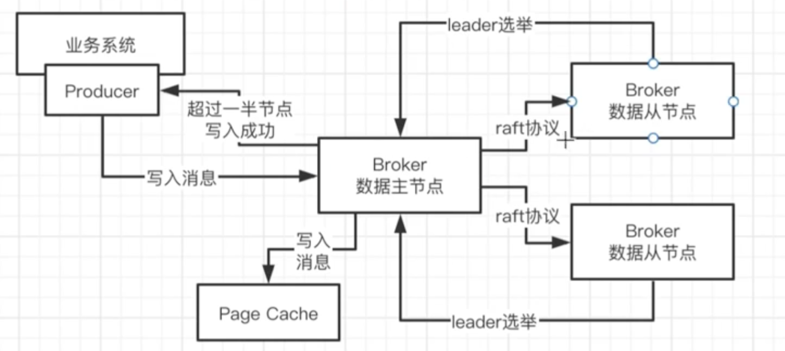
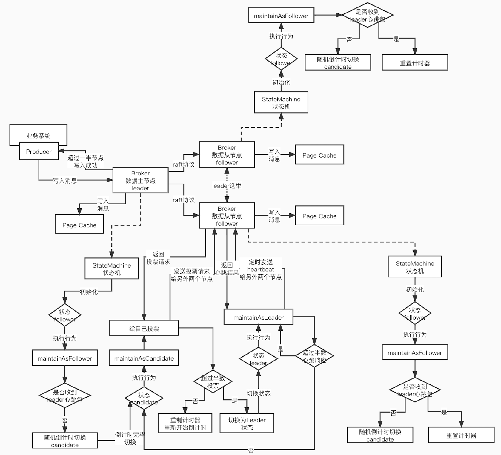
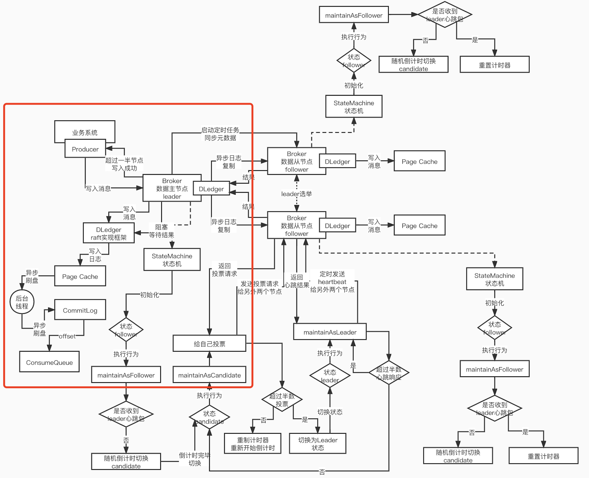
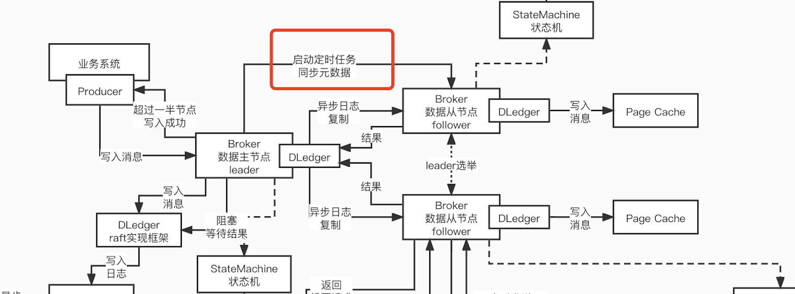
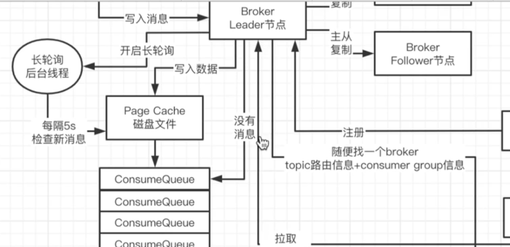
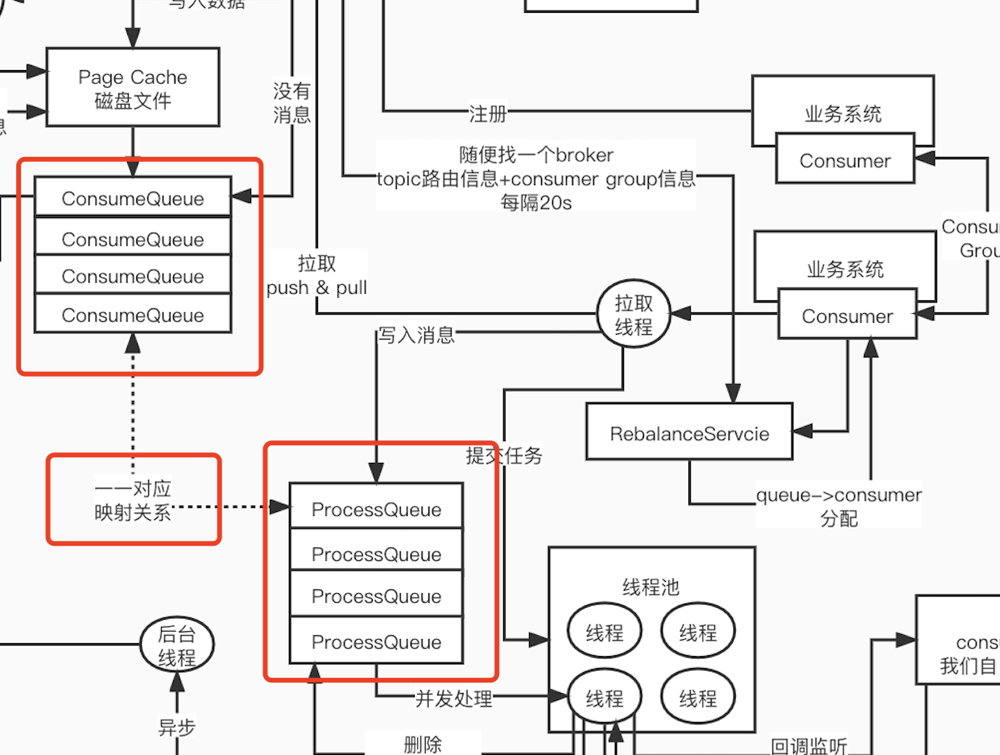
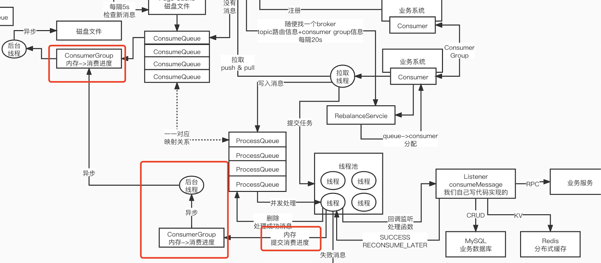
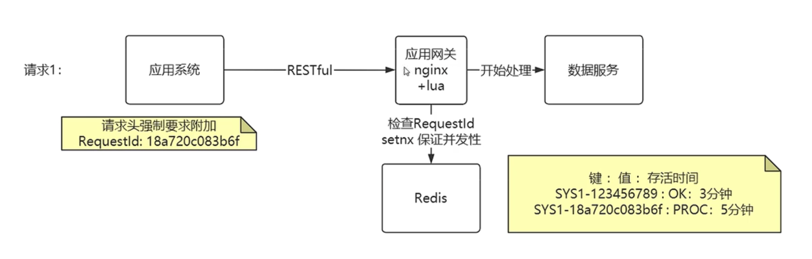
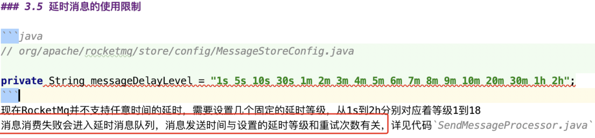
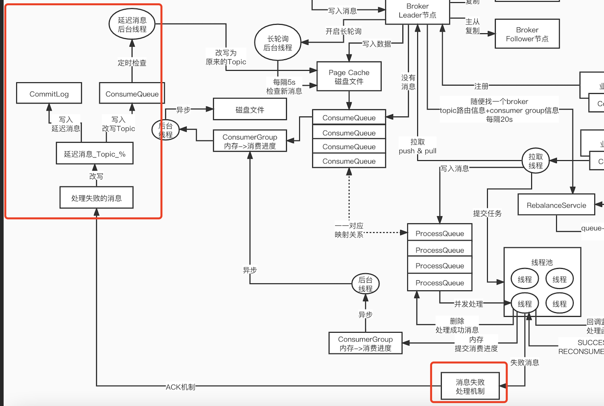

# RocketMQ 主从

## 1. Broker 基于 Pull 模式的主从复制原理

borker 中获取消息的方式有两种, 本质都是 pull

- push模式
- pull模式

push模式 -> 我们业务系统的producer往broker主节点里写入数据之后，直接由broker主节点主动的把数据push发送到从节点里面去

pull模式 -> producer仅仅是往broker主节点里写入数据，此时主节点是不会主动的把数据推送到从节点里去，是等待从节点反过来发送pull拉取数据的请求，然后主节点收到了拉取数据的请求之后，才会把数据发送给从节点

### 1.1 那怎样保证同步过程数据 0 丢失呢?

- 数据写入的时候同步刷盘
- 写入数据之后理解进行同步复制

如果`broker主节点改成同步刷盘机制之后`，每一次写入，必须把数据输入到物理磁盘的层面，此时写入才会返回，broker jvm进程崩溃，数据100%不会丢，broker部署所在的服务器突然宕机了（断电），此时数据页不会丢失了，因为数据在物理磁盘上，第三种极端中的极端中的多年难得一遇的场景，物理磁盘坏了（没法恢复数据), `仅仅是依赖broker主节点同步刷盘，还是会存在物理磁盘损坏，导致数据丢失`；主节点崩溃了以后，此时，如果你的数据还没来得及同步给我们的从节点，此时主节点崩溃了，从节点还没同步到这个数据，此时你从从节点里读取数据，是读不到的，这也是一个问题，短时间内，如果主节点没有恢复，从节点也是读不到数据的, 其次每次刷盘对性 IO 性能损耗是极其大的

所以这么看来真正做到 0 丢失还是不太现实, 99%，99.9%，99.99%，99.999% -> 无限的逼近与100%，无限的把损失的概率降低到接近于0%，这是我们能做到的事情

所以默认情况下是 **异步刷盘,异步复制**  

### 1.2 RocketMQ 主从漂移-惰性读写分离模式

默认情况下，rocketmq是不倾向于主动让你直接长期进行读写分离的，**倾向于写和读都是在主节点来进行的**，从节点主要是用于进行数据复制和同步，实现热备份，万一主节点挂了，此时作为一个备选，才会去从从节点那里读取数据

如果说主节点过于繁忙，积压了大量的消息，处理不过来了，写和读，积压的消息数量，超过了他本地内存的40%，自己定了一个比例 -> 主节点太繁忙了 -> 在你发起一次拉取消息请求之后，**他会通知你下一次拉取消息的 broker id 是谁(也就是选择了一台从节点来完成你的拉取请求)**, 从节点发现自己本地的消息积压量小于自己的物理内存30%，说明拉取很顺利很快速, 说明主节点消息没有过多的挤压, 从新返回 broker id (主节点), 继续在主节点中工作

#### 为什么采用 主从漂移?

> broker的读写分离采用的是 **主从漂移模式(ip漂移)**，主从机器对外提供一个完整的服务，你在访问的时候，有的时候访问主，有的时候访问从，此时主从之间的给你访问的ip漂移，一会儿漂移到主，一会儿漂移到从, 所以说 **RocketMQ 的读写分离不是彻底的读写分离** , 从节点的数据多用于 读取，备用，备选

#### 什么时候会在从节点进行消费和读取呢?

> 如果说 **主节点过于繁忙** ，积压的没消费的消息太多了，都占比达到了自己物理内存的40%了(主节点过于繁忙)，cpu负载可能很高（大量的读写线程并发运行，机器运行效率可能都降低了），来不及处理这么多的请求了, 此时消费请求漂移到从节点去，出现了 **请求漂移**
>
> **主节点如果崩溃**，毫无疑问的，只能从从节点去进行消费了
>
> 在从节点消费的非常好**消息的积压数量很快就下降到了从节点物理内存的30%占比以内，就说明你此时消费一切良好，又会让你漂移回主节点去了**

以上的这种方式我们称为 **惰性读写分离模式**

#### 为什么采用 惰性读写分离模式(解决元数据不统一的情况)?

> RocketMQ作为一个特殊的中间件系统，他要维护你的每个consumer对一个queue的消费进度, 当你 consumer 挂掉或者宕机, 在从新启动之后, 需要接着上次的 消费进度(offset) 进行继续消费, 关键来了, 设想有多个从节点, 负载均衡随机读取, 这里的 offset 的同步和维护和集中保存就成了问题, 所以才用了 **惰性读写分离模式**
>
> 从节点会每隔 10s 对主节点进行一个 **元数据同步**, 因为有些时候会漂移到从节点进行读取消费, 数据会发生一些变动, 这时候同步到主节点 进行 merge 操作,  保证数据的一致性

### 1.3 Broker数据与服务是否都实现高可用了？

broker 4.5.0之前，主节点崩溃了之后，是没有高可用主从切换机制，主从在4.5.0之前仅仅是用来进行热备份的，让主节点数据在从节点也有一份，主节点崩了之后，这个时候就全靠从节点提供有限的数据和服务了, **在 4.5.0之前没有实现高可用**

服务高可用，broker提供的服务就两个，一个是写，一个是读，写数据，读数据

所以 4.5.0之前版本 只能说是实现了大部分的数据不丢失而已，主从同步实现了热备份，热同步，主节点全崩的时候，从节点保留了大部分的数据

rocketmq在4.5.0之后，做一个最新的架构改造，主从同步+主从切换（高可用机制，数据和服务，都是高可用）

#### rocketMQ 怎样实现高可用更合理呢?

数据写入，直接进page cache就可以了，但是主从同步，在采用pull模式情况下如果你要实现主从数据强一致的同步，必然会导致你必须去等待人家过来pull拉取数据，时效性一般来说比较差, 那么可以做出一下整改

- 主从数据强一致，写入主节点，主节点直接进page cache就算成功了，到此为止，速度还是很快的(写内存)，此时 **采取一个push的模式** ，直接把你的这条数据能否push同步给你的一个从节点，写请求只要等待一次从节点的push成功就可以了

- 对于从节点，同样也是采取了异步刷盘的策略，他收到了一条消息之后，直接也是写入page cahce就可以返回说本次 push 同步成功的消息

以此实现了数据的强一致性(主从同步), 其次对于性能影响适中, 因为数据直接刷入 page cache, 而不是硬盘 

### 1.4 Broker 主从结构图

## 2. 基于 raft 的主从架构

raft协议，raft协议本身来说就是一套针对这种分布式系统，对多台机器进行Leader选举+主从同步复制+主从切换，定义了这样的一套算法和方法论

### 2.1 raft 协议的 leader 选举算法介绍

- 尽量配置奇数个 Broker, 方便后续的投票选举
- 每个follower都会给自己设置一个150ms ~ 300ms 之间的一个随机时间，随机的倒计时时间，也就是说有的follower可能会倒计时 150ms，有的可能是160ms，有的可能是 240ms，大家的时间一般是不一样的 **肯定有一个 follower 倒计时时间是最少的，他是最先完成倒计时的**

- 第一个完成倒计时，苏醒过来的那个follower，此时他会把自己的身份转变为candidate，他开始把自己变成一个leader候选人，他会开始想要竞选成为一个 leader，就需要大家一起来投票，他自己也可以投票，想当然，他当然会投票给他自己(我觉得我自己可以当 leader)

- 这是不够的，他还需要得到别人的认可，这个很关键，他会发送请求给其他的节点，进行拉票的动作，他把拉票的请求发送给另外2个还是 follower 状态的节点，他们还在进行倒计时呢, follower 节点，此时收到一个拉票的请求之后，如果他之前没有给别人投过票，此时收到了一个拉票的请求，就会把这个票投给你，如果他要是之前投票给别人了，此时他就拒绝你的拉票

- 此时的两个follower，他们肯定没有投过票，因为他们之前一直在倒计时，这两个 follower 会把票都投给我们的第一个苏醒过来的 candidate，candidate 完成了拉票之后，因为那 两个 follower 都把票投给了他，他此时发现自己的得票数，已经超过了半数了，n/2+1，过半数的数量，quorum，大多数

- 比如说他之前倒计时 250ms，**此时还有50ms就要倒计时完毕了，但是收到了一个人说自己是leader，就会重置自己的倒计时计时器，重新从250ms开始进行计时，leader维持自己的地位的手段**

### 2.2 Broker 基于状态机实现的 leader 选举

状态机就是状态模式的一个运用，状态设计模式，你的系统可以维护多个状态(State)，多个 State 之间可以进行切换，每次切换到一个新的 State 之后，执行的行为是不同的，行为是跟 State 是绑定在一起的 , 状态设计模式 -> 状态机 -> state machine，就是跟状态设计模式是差不多的，可以维护多个state状态，不同的状态可以对应不同的行为, **rocketMQ-broker在实现leader选举的时候，采取的就是一个状态机制来实现**

极端情况三个 broker 的倒计时一致, 同时给自己完成投票, 此时不会向相邻结点发起心跳进行拉票, 而是进行又一次的倒计活动

## 3.Broker 基于 DLedger 的数据写入流程(producer)

raft协议之下，只有leader可以对外提供服务(写和读的服务)，follower是不对外提供服务的，他们仅仅是进行数据复制和同步，leader故障的时候，完成重新的leader选举，继续对外提供服务

raft协议之下，过半写成功机制，允许对follower发起一个读的话，可能会有一个问题，可能会读到那个还没复制成功数据的follower，会导致对外看到的数据视图是不一致的，为了解决数据写和读的一致的问题, 写和读都针对 leader 就可以了，写成功了，你去读，一定是可以读到数据的

这里就引用了 Dledger(可以理解为基于 raft 实现的框架),与原理的写入流程不同的是, 这里消息是以日志的方式写入 page Cache 中, leader 写入日志信息后, **会异步的将日志复制到 follower 结点中, 但是会同步的等待复制结果**

- leader 通过 Dledger 将数据以日志形式写入 page Cache, 阻塞等待结果
- 通过 Dledger 将日志信息异步复制给 follower (**由原来的 pull 模式 更改为了 push 模式, 提升了性能**)
- follower 会将 Dledger 日志复制的结果返回给 leader, leader-Dledger 发现超过半数的结点完成了数据同步, 停止阻塞等待结果, 返回成功响应

### 3.1 Broker 引入 DLedger 后的存储兼容设计

当修改成了 Dledger(raft 实现框架) 方式写入数据后, 消息数据被调整为了 dledger 的日志格式，针对这个日志格式，是怎样和之前 CommitLog 方式做到兼容的呢?

> dledger 写入的日志格式的数据，写入 CommitLog 里面去，header 和 body 两个部分，其中 header 这里是包含了很多的 header 头字段（每个头字段4个字节，或者几个字节），至于 body 长度不固定
>
> 原始的 CommitLog 存储的一条一条的数据，会把原始的 CommitLog 里的数据(一个数据条目)，给他放到 dledger 里面的 body 里面去，header头字段 + body（CommitLog原始数据），不就可以了吗，把 dledger 数据存储结构和原始的 CommitLog 做了一个兼容和整合，两块数据就集成到一起
>
> CommitLog 里是每一条数据都有 header+body，此时你如果偏移量从header开始去计算就不对了，在 ConsumeQueue 里重构为，在 queue 里放入的每个数据的offset偏移量是 CommitLog 里一条数据body 起始的物理偏移量

### 3.2 Broker 主从节点之间的元数据同步

通过 DLedger 保证了主从数据一致性的, 这里还有一个问题就是, 一旦主节点崩溃, 主从之间的元数据怎么办(消费offset...)

follower 通过一个线程启动定时任务, 进行元数据的同步

## 4. 主从架构下 consumer 运行原理

### 4.1 Consumer端队列负载均衡分配机制

topic是有一堆的queue，而且分布在不同的broker上；consumer group 是有多个consumer，我们要把多个queue 分配给多个 consumer，每个 consumer 都会分配到一部分的queue

那么谁来负责这个 queue->consumer 分配?  topic里的queue信息从哪里获取?  如何知道一个consumer group里到底有多少个consumer 

这里如果有这么一个负责资源分配的角色, 上面的问题就都迎刃而解了, **RebalanceService** 就出现了, 也就是每个 Consumer 都含有这样一个 **RebalanceService**, 负责信息拉取与资源分配

- 首先 consumer 向所有的 broker 进行信息注册，每个 broker 都知道一个consumer group 中所有的 consumer 信息, 以及 topic queue 信息

- 每个 consumer 随便找一个 broker 都可以获取到 topic 有多少个 queue，consumer group里有多少个consumer , **Consumer- RebalanceService** 便从 broker 拉取 topic queue 信息，拉取 consumer group 信息

- 通过上述的方式获取信息后, 每个 consumer 拉取到的信息是一致的, 那么按照 相同的算法(平均分配算法、轮询分配算法、一致性hash、配置化、集中分配) 去做资源分配, 得到的分配结果也一定是一致的
- consumer 消费存在 push / pull 两种模式, 但是本质实现都是 pull 模式, 你要是没有开启consumer拉取消息的 long polling(长轮询机制)，模式使用short polling(短轮询机制)，默认情况下他会挂起1s(shortPollingMillis)，参数可以去进行控制，如果开启了long polling长轮询机制(存在两种方式 push / pull, 长时间挂起去进行消息拉取) ，如果是 **长轮询 push 模式**，你会挂起+每隔5s检查，一直到15s都没有拉到消息，此时才会超时返回，如果是 **长轮询 pull 模式**，挂起超时时间20s，他们不同模式的参数控制的时间不太一样

### 4.2 Consumer 的处理队列映射 与 并发消费

- **Consumer 中负责拉取消息的线程只有一个**, 拉取到的消息会被传递到 **ProcessQueue** 中, ConsumerQueue 与 ProcessQueue 是一一映射关系(ConsumerQueue 可以细分为 writeQueue 和 readQueue, Consumer 是从 readQueue 中拉取数据)

- Consumer 中会存在一个线程池并发的向 ProcessQueue 中读取消息, 客户端依靠 RocketMQ 提供的 **Listener.ConsumeMessage** Api, **构成线程池的一个回掉函数**, 进行最终消息的消费, 后续就是进入我们业务的处理环节了....

- 客户端处理完成结果后, 会返回状态, 一般分为两种, **SUCCESS** 和 **RECONSUME_LATER** , **处理成功的消息(SUCCESS)会在 ProcessQueue 中进行删除**

### 4.3 Consumer 处理成功后的消费进度管理

- 处理成功(SUCCESS), 先在 ProcessQueue 中删除消息
- 此时 Consumer 端会对Consumer Group 的消费进度进行内存的存储, 然后由后台线程异步同步到 broker 消费进度的内存中
- broker 再通过后台线程异步将消费进度同步到文件中

### 4.4 消息重复消费原理

 在 **消息未处理** 或者 **消息处理完成  但是消费进度还未同步到 broker 的消费进度内存中**, cunsumer 挂掉或者重启了, 那么就会产生 消息重复消费 的问题

 **幂等性 + 分布式锁** 来解决重复消费的问题

#### 幂等性

> 幂等性最早是数学里面的一个概念，后来被用于计算机领域
>
> 用于表示任意多次请求 均与一次请求执行的结果相同
>
> 对于一个接口而言，无论调用了多少次，最终得到的结果都是一样的

常见的实现幂等性的几种方式:

- 前端拦截: 前端拦截是指通过 Web 站点的页面进行请求拦截，比如在用户点击完“提交”按钮后, 我们可以把按钮设置为不可用或者隐藏状态，避免用户重复点击 (问题在于可以跳过 JS 直接请求接口)

- 使用数据库实现幂等性 (问题在于并发情况下效率差)

  - 通过悲观锁实现

  - 通过唯一索引实现  
  - 通过乐观锁实现 (update table_name set version=version+1 where version=0)

- 使用 golang 中的 Mutex (问题在于只适合单机系统, 不适合分布式系统)

- 使用分布式锁实现幂等性: 分布式锁实现幂等性的逻辑是，在每次执行方法之前先判断是否可以获取到分布式锁, 如果可以，则表示为第一次执行方法，否则直接舍弃请求即可

请求进来:

业务处理结束:

**幂等性注意事项**

> 幂等性的实现与判断需要消耗一定的资源，因此不应该给每个接口都增加幂等性判断
> 要根据实际的业务情况和操作类型来进行区分
>
> 例如: 我们在进行查询操作和删除操作时就无须进行幂等性判断
> 查询操作查一次和查多次的结果都是一致的，因此我们无须进行幂等性判断
> 删除操作也是一样，删除一次和删除多次都是把相关的数据进行删除（条件删除）
> 因此也无须进行幂等性判断

**幂等性的关键步骤**

实现幂等性的关键步骤分为以下三个：

- 每个请求操作必须有唯一的1D，而这个1D 就是用来表示此业务是否被执行过的关键凭证, 例如，订单支付业务的请求，就要使用订单的ID 作为幂等性验证的Key
- 每次执行业务之前必须要先判断此业务是否已经被处理过
- 第一次业务处理完成之后，要把此业务处理的状态进行保存, 比如存储到 Redis 中或者是数据库中，这样才能防止业务被重复处理

### 4.5 处理失败时的 延迟消费机制(RECONSUME_LATER)

当客户端返回 RECONSUME_LATER 状态后, 会进入一个延迟消费的过程

- 首先在 ProcessQueue 中删除消息
- 通过 ACK 机制将处理失败的消息上报给 broker 进行重复消费
- broker 将处理失败的消息改写到 `延迟消息_Topic`_% 中
-  `延迟消息_Topic`_% 将消息重新写入至新的 CommitLog 和 ConsumeQueue 中
- 由延迟消息的后台线程定时检测, (**这里注意的是, 每次延迟消费的时间间隔与失败重试次数有关**), 将 ConsumeQueue 中的处理失败的消息改写至原理啊的 Topic 中

- 改写之后就可以继续走 producer push 新消息的流程了

**完整举例**

这个延时消息是30分钟的，那么30分钟之后会从延时消息队列的topic中取出来，然后给放入到原来的topic这样消费者就去消费原来topic的消息了

但是如果消费失败的，consumer端会告诉broker端失败了

那么borker端会把这个延时消息，在重新给当做一条新的消息写入到延时队列的topic中，比如延时30分钟，那么就是有一条新的消息在延时队列的topic中30分钟之后被消费到

至于 CommitLog, CommitLog是追加写的, 可能是同一个，也可能不是同一个，主要的是这个 CommitLog 里面有延时队列的topic的信息，topic下的messagequeue的id，这个消息里面有原来 topic、messagequeue、原来的消息在commitlog中的 position 位置

### 完整流程图

