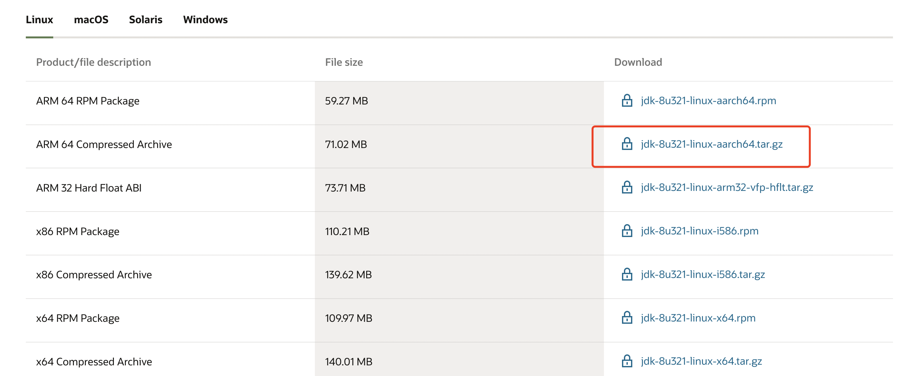
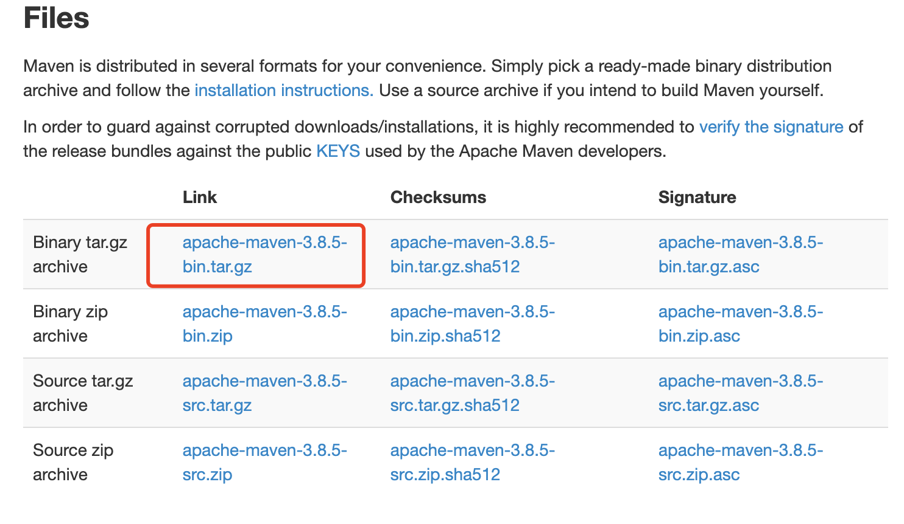

# [jdk 安装](https://www.oracle.com/java/technologies/downloads/)

首先确定系统的版本 `uname -a`

````
[root@99 ~]# uname -a
Linux 99 5.11.12-300.el8.aarch64 #1 SMP Fri Jul 30 12:03:15 CST 2021 aarch64 aarch64 aarch64 GNU/Linux
````



- 卸载自带或历史 jdk, `rpm -qa | grep java` ``
- wget https://www.oracle.com/java/technologies/downloads/#license-lightbox 
  - 如果下载出错, web 端下载完成, 通过 `scp -r local_dir username@servername:remote_dir` 上传, 例如：scp -r test  root@192.168.0.101:/var/www/  把当前目录下的test目录上传到服务器的/var/www/ 目录
- mkdir /usr/local/java/
- tar -zxvf jdk-8u321-linux-x64.tar.gz -C /usr/local/java/
- vim /etc/profile

````
export JAVA_HOME=/usr/local/java/jdk1.8.0_321
export JRE_HOME=${JAVA_HOME}/jre
export CLASSPATH=.:${JAVA_HOME}/lib:${JRE_HOME}/lib
export PATH=${JAVA_HOME}/bin:$PATH
````

- `source /etc/profile` 使配置文件生效
- `ln -s /usr/local/java/jdk1.8.0_321/bin/java /usr/bin/java. 添加软连接
  `
- `java -version` 然后查看jdk是否安装成功

```
[root@99 ~]# java -version
java version "1.8.0_321"
Java(TM) SE Runtime Environment (build 1.8.0_321-b07)
Java HotSpot(TM) 64-Bit Server VM (build 25.321-b07, mixed mode)
```
## yum 安装
````
yum install -y java-1.8.0-openjdk-devel.x86_64     # 这里是适配 x86_64

java -version
````

# [maven 安装](https://maven.apache.org/download.cgi)



- wget https://dlcdn.apache.org/maven/maven-3/3.8.5/binaries/apache-maven-3.8.5-bin.tar.gz
- tar -zxvf apache-maven-3.8.5-bin.tar.gz
- mv apache-maven-3.8.5 /usr/local/maven && cd /usr/local/maven

````
[root@99 maven]# ls
LICENSE  NOTICE  README.txt  bin  boot  conf  lib
````

- vim /etc/profile

````
## maven
export PATH=$PATH:/usr/local/maven/bin
````

- source /etc/profile
- mvn -version 检查版本 信息

````
[root@99 maven]# mvn -version
Apache Maven 3.8.5 (3599d3414f046de2324203b78ddcf9b5e4388aa0)
Maven home: /usr/local/maven
Java version: 1.8.0_321, vendor: Oracle Corporation, runtime: /usr/local/java/jdk1.8.0_321/jre
Default locale: en_US, platform encoding: ANSI_X3.4-1968
OS name: "linux", version: "5.11.12-300.el8.aarch64", arch: "aarch64", family: "unix"
````
