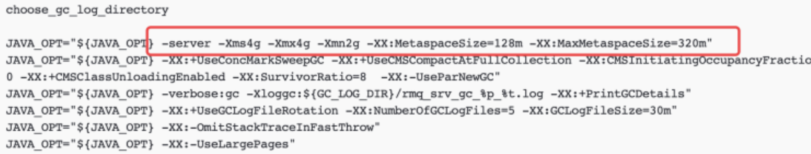
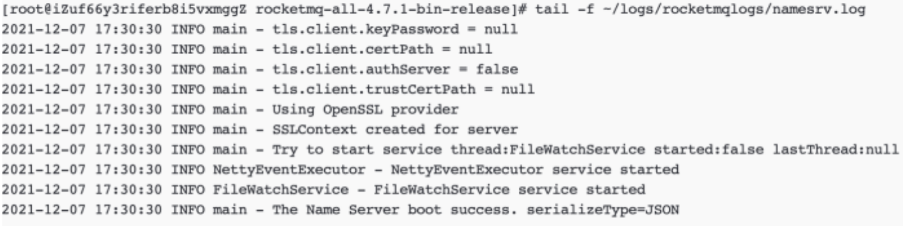
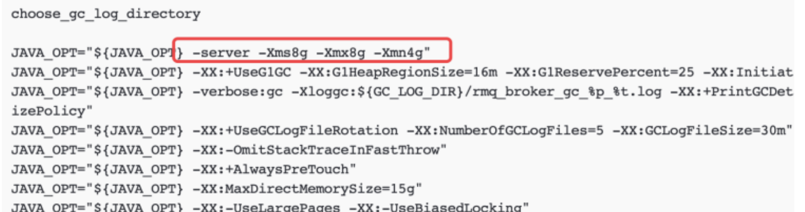
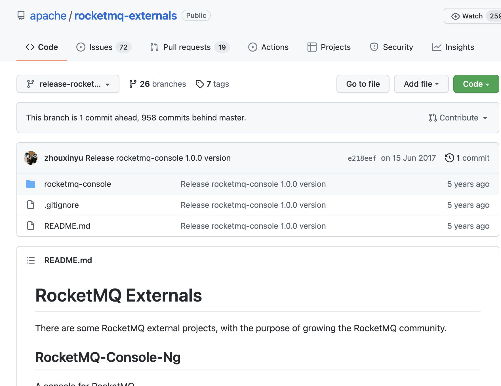
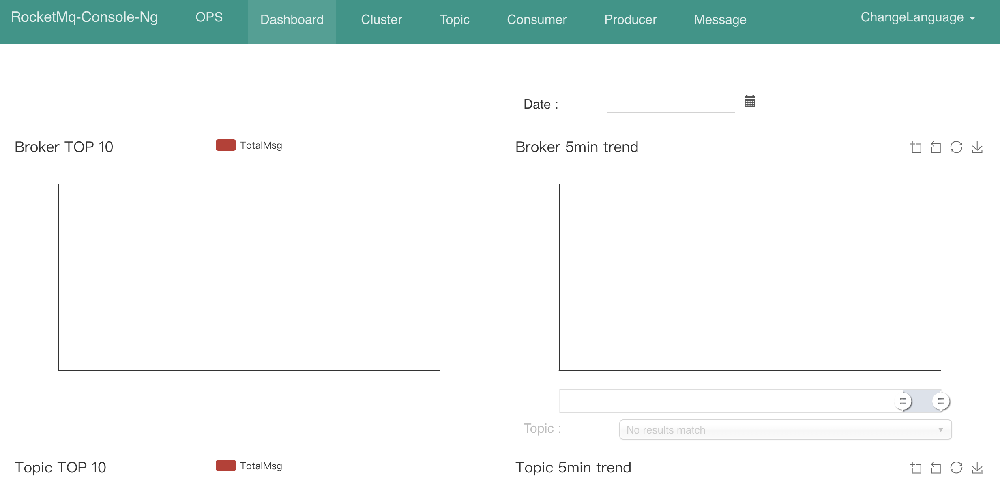

# [RocketMQ](http://rocketmq.apache.org/)

## 1.CentOS8 安装

rocketmq也是基于java的，所以需要先确保jdk已经安装好

[下载地址](https://archive.apache.org/dist/rocketmq/)

- wget https://archive.apache.org/dist/rocketmq/4.7.1/rocketmq-all-4.7.1-bin-release.zip 
- unzip rocketmq-all-4.7.1-bin-release.zip 
- cd rocketmq-all-4.7.1-bin-release 

操作目录
````
[root@99 rocketMQ]# pwd
/usr/local/rocketMQ
[root@99 rocketMQ]# ls
LICENSE  NOTICE  README.md  benchmark  bin  conf  lib  nohup.out
````

### 1.1 启动Name Server

- 启动之前先检查⼀下Name Server的jvm配置，避免服务器内存不⾜，导致出现各种问题 `vi ./bin/runserver.sh`



````
choose_gc_log_directory

// 堆内存默认给了4G，⽐较占⽤内存了，如果只是开发测试环境，建议调⼩jvm的配置, 这里整体缩小了 1/2 倍
JAVA_OPT="${JAVA_OPT} -server -Xms2g -Xmx2g -Xmn1g -XX:MetaspaceSize=128m -XX:MaxMetaspaceSize=320m"
JAVA_OPT="${JAVA_OPT} -XX:+UseConcMarkSweepGC -XX:+UseCMSCompactAtFullCollection -XX:CMSInitiatingOccupancyFraction=70 -XX:+CMSParallelRemarkEnabled -XX:SoftRefLRUPolicyMSPerMB=0 -XX:+CMSClassUnloadingEnabled -XX:SurvivorRatio=8  -XX:-UseParNewGC"
JAVA_OPT="${JAVA_OPT} -verbose:gc -Xloggc:${GC_LOG_DIR}/rmq_srv_gc_%p_%t.log -XX:+PrintGCDetails"
JAVA_OPT="${JAVA_OPT} -XX:+UseGCLogFileRotation -XX:NumberOfGCLogFiles=5 -XX:GCLogFileSize=30m"
JAVA_OPT="${JAVA_OPT} -XX:-OmitStackTraceInFastThrow"
JAVA_OPT="${JAVA_OPT} -XX:-UseLargePages"
JAVA_OPT="${JAVA_OPT} -Djava.ext.dirs=${JAVA_HOME}/jre/lib/ext:${BASE_DIR}/lib:${JAVA_HOME}/lib/ext"
#JAVA_OPT="${JAVA_OPT} -Xdebug -Xrunjdwp:transport=dt_socket,address=9555,server=y,suspend=n"
JAVA_OPT="${JAVA_OPT} ${JAVA_OPT_EXT}"
JAVA_OPT="${JAVA_OPT} -cp ${CLASSPATH}"
````

- 守护进程⽅式启动 NameServer()： `nohup sh ./bin/mqnamesrv & ` 
- 查看启动⽇志： `tail -f ~/logs/rocketmqlogs/namesrv.log `



### 1.2 启动 broker

启动之前先检查⼀下Broker的jvm配置，避免服务器内存不⾜，导致出现各种问题, `vi bin/runbroker.sh `



```
choose_gc_log_directory

// 由于在虚拟机使用, 这里统一变为原来的 1/4
JAVA_OPT="${JAVA_OPT} -server -Xms2g -Xmx2g -Xmn1g"
JAVA_OPT="${JAVA_OPT} -XX:+UseG1GC -XX:G1HeapRegionSize=16m -XX:G1ReservePercent=25 -XX:InitiatingHeapOccupancyPercent=30 -XX:SoftRefLRUPolicyMSPerMB=0"
JAVA_OPT="${JAVA_OPT} -verbose:gc -Xloggc:${GC_LOG_DIR}/rmq_broker_gc_%p_%t.log -XX:+PrintGCDetails -XX:+PrintGCDateStamps -XX:+PrintGCApplicationStoppedTime -XX:+PrintAdaptiveSizePolicy"
JAVA_OPT="${JAVA_OPT} -XX:+UseGCLogFileRotation -XX:NumberOfGCLogFiles=5 -XX:GCLogFileSize=30m"
JAVA_OPT="${JAVA_OPT} -XX:-OmitStackTraceInFastThrow"
JAVA_OPT="${JAVA_OPT} -XX:+AlwaysPreTouch"
```
#### 守护进程⽅式启动Broker： `nohup sh bin/mqbroker -n ip:9876 & `

这里可以修改一下配置文件
````
brokerClusterName = DefaultCluster
brokerName = broker-a
brokerId = 0
deleteWhen = 04
fileReservedTime = 48
brokerRole = ASYNC_MASTER
flushDiskType = ASYNC_FLUSH

## add other info
brokerIP1=172.16.252.99
namesrvAddr=172.16.252.99:9876
`````
#### 守护进程⽅式启动Broker 并指定配置文件: `nohup sh /usr/local/rocketMQ/bin/mqbroker -n 172.16.252.99:9876 -c /usr/local/rocketMQ/conf/broker.conf  autoCreateTopicEnable=true &`
```
[root@99 ~]# netstat -nltp
Active Internet connections (only servers)
Proto Recv-Q Send-Q Local Address           Foreign Address         State       PID/Program name
tcp        0      0 0.0.0.0:22              0.0.0.0:*               LISTEN      898/sshd
tcp6       0      0 :::8080                 :::*                    LISTEN      2200/java
tcp6       0      0 :::9876                 :::*                    LISTEN      2111/java
tcp6       0      0 :::22                   :::*                    LISTEN      898/sshd
tcp6       0      0 :::10909                :::*                    LISTEN      2137/java
tcp6       0      0 :::10911                :::*                    LISTEN      2137/java
tcp6       0      0 :::10912                :::*                    LISTEN      2137/java
```
ip:9876是 Name Server服务的地址与端⼝, 查看启动⽇志： `tail -f ~/logs/rocketmqlogs/broker.log `


**问题1：启动Broker时报错：**
````
Error: VM option ‘UseG1GC’ is experimental and must be enabled via -XX:+UnlockExperimentalVMOptions.
Error: Could not create the Java Virtual Machine.
Error: A fatal exception has occurred. Program will exit.


解决方法：查看bin/mqbroker的脚本可发现，其中调用了runbroker.sh，编辑runbroker.sh，发现其中有UseG1GC的可选项（实验性的选项），删除这一行即可。

[root@99 rocketMQ]# vim bin/runbroker.sh
// ..
JAVA_OPT="${JAVA_OPT} -XX:+UseG1GC -XX:G1HeapRegionSize=16m -XX:G1ReservePercent=25 -XX:InitiatingHeapOccupancyPercent=30 -XX:SoftRefLRUPolicyMSPerMB=0"
````
### 1.3 启动 console 控制台

[下载地址](https://github.com/apache/rocketmq-externals/tree/release-rocketmq-console-1.0.0)



- git clone git@github.com:apache/rocketmq-externals.git
- 进入目录

````
[root@99 ~]# cd rocketmq-externals-rocketmq-console-1.0.0/
[root@99 rocketmq-externals-rocketmq-console-1.0.0]# ls
README.md  rocketmq-console
[root@99 rocketmq-externals-rocketmq-console-1.0.0]# cd rocketmq-console/
[root@99 rocketmq-console]# pwd
/root/rocketmq-externals-rocketmq-console-1.0.0/rocketmq-console
````

- `mvn clean package -Dmaven.test.skip=true` 将项目打成jar包，并运行jar文件

```
Downloaded from central: https://repo.maven.apache.org/maven2/org/codehaus/plexus/plexus-archiver/3.4/plexus-archiver-3.4.jar (187 kB at 6.2 kB/s)
Downloaded from central: https://repo.maven.apache.org/maven2/org/codehaus/plexus/plexus-utils/3.0.24/plexus-utils-3.0.24.jar (247 kB at 5.6 kB/s)
Downloaded from central: https://repo.maven.apache.org/maven2/org/apache/commons/commons-compress/1.11/commons-compress-1.11.jar (426 kB at 8.7 kB/s)
[INFO] Building jar: /root/rocketmq-externals-rocketmq-console-1.0.0/rocketmq-console/target/rocketmq-console-ng-1.0.0-sources.jar
[INFO] ------------------------------------------------------------------------
[INFO] BUILD SUCCESS
[INFO] ------------------------------------------------------------------------
[INFO] Total time:  16:09 min
[INFO] Finished at: 2022-04-08T09:27:38+08:00
[INFO] ------------------------------------------------------------------------
```

出现以上提示证明已经生成好了 jar文件, 根据提示, 在 `/root/rocketmq-externals-rocketmq-console-1.0.0/rocketmq-console/target/rocketmq-console-ng-1.0.0-sources.jar` 的位置

```
[root@99 rocketmq-console]# cd /root/rocketmq-externals-rocketmq-console-1.0.0/rocketmq-console/target
[root@99 target]# ls
checkstyle-cachefile    checkstyle-result.xml  generated-sources  maven-status  rocketmq-console-ng-1.0.0-sources.jar  rocketmq-console-ng-1.0.0.jar.original
checkstyle-checker.xml  classes                maven-archiver     nohup.out     rocketmq-console-ng-1.0.0.jar
```

- `mv ./rocketmq-console-ng-1.0.0.jar   /usr/local/rocketMQ/lib`   移动至 RockeMQ的工具目录
- 守护进程⽅式启动rocketmq-console    `nohup java -jar -server -Xms2g -Xmx2g  -Duser.timezone="Asia/Shanghai" -Drocketmq.config.namesrvAddr=172.16.252.99:9876 -Dserver.port=8080 rocketmq-console-ng-1.0.0.jar &`   (nohup java -jar -Duser.timezone="Asia/Shanghai" -Drocketmq.config.namesrvAddr=172.16.252.99:9876 -Dserver.port=8080 /usr/local/rocketMQ/lib/rocketmq-console-ng-1.0.0.jar &)
- 浏览器访问console控制台： http://ip:8080/



## Docker 安装 

````
docker pull rocketmqinc/rocketmq // 拉取官方镜像

docker pull styletang/rocketmq-console-ng // 拉取rocketmq-console镜像(可视化界面)
````

运行(这里是windows环境)

````
// 运行nameserver
docker run -d -p 9876:9876 -v D:\\rocketMQ\\data\\namesrv\\logs:/root/logs -v D:\\rocketMQ\\data\\namesrv\\store:/root/store --name rmqnamesrv  rocketmqinc/rocketmq sh mqnamesrv
// 运行broker
docker run -d -p 10911:10911 -p 10909:10909 -v D:\\rocketMQ\\data\\broker\\logs:/root/logs -v D:\\rocketMQ\\data\\broker\\store:/root/store --name rmqbroker --link rmqnamesrv:namesrv -e "NAMESRV_ADDR=namesrv:9876" rocketmqinc/rocketmq sh mqbroker -c /opt/rocketmq-4.4.0/conf/broker.conf
````

修改配置文件: `docker exec -it rmqbroker /bin/sh`, 修改配置 `vi /opt/rocketmq-4.4.0/conf/broker.conf`

````
在broker.conf文件内新增brokerIP1属性，即：
brokerIP1 = 本机外网ip地址(ipconfig 即可获取)
````

重启容器: `docker container restart rmqbroker`

运行rocketmq-console

````
docker run -e "JAVA_OPTS=-Drocketmq.namesrv.addr=192.168.60.66:9876 -Dcom.rocketmq.sendMessageWithVIPChannel=false" -p 8001:8080 -t styletang/rocketmq-console-ng
`````

查看主页: `http://localhost:8001`
