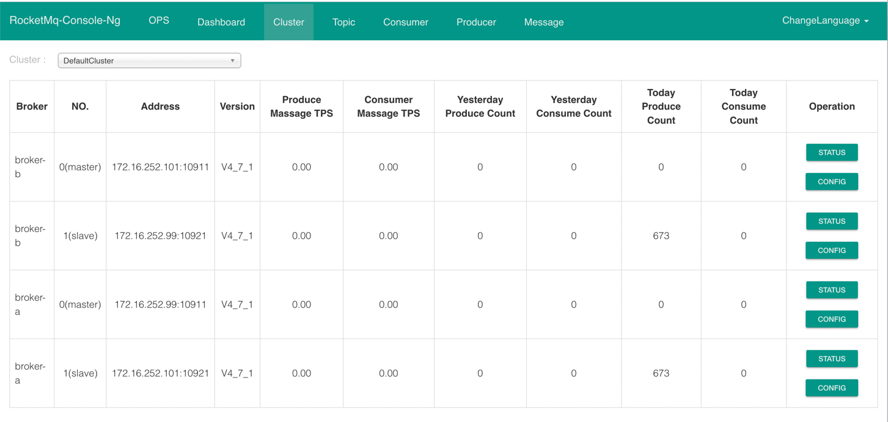

## 集群安装
### 规划
资源有限，采用两台主机，搭建双主双从
````
nameServ1 注册中心 172.16.252.99:9876
nameServ1 注册中心 172.16.252.101:9876

broker-a   --master 172.16.252.99:10911  // broker-a.properties
broker-b-s --slave  172.16.252.99:10921  // broker-b-s.properties

broker-b   --master 172.16.252.101:10911  // broker-b.properties
broker-a-s --slave  172.16.252.101:10921  // broker-a-s.properties
````
### 配置文件
参数含义：
- NameServer 的地址，可以是多个 `namesrvAddr=172.16.252.99:9876;172.16.252.101:9876`

- Cluster 的地址，如果集群机器数比较多，可以分成多个 Cluster ，每个Cluster 供一个业务群使用 `brokerClusterName=DefaultCluster`

- Broker 的名称， Master Slave 通过使用相同的 Broker 名称来表明相互关系，以说明某个 Slave 是哪个 Master Slave `brokerName=broker-a`

- 一个 Master Barker 可以有多个 Slave, 0 表示 Master，大于 0 表示不同 Slave 的 ID `brokerId=0`

- 在磁盘上保存消息的时长，单位是小时，自动删除超时的消息 `fileReservedTime=48`

- 与 fileReservedTime 参数呼应，表明在几点做消息删除动作，默认值 04 示凌晨 `deleteWhen=04`

- brokerRole 有3种：`SYNC_MASTER`、 `ASYNC_MASTER`、 `SLAVE`。关键词 `SYNC` 和 `ASYNC` 表示 Master 和 Slave 之间同步消息的机制，
`SYNC` 的意思是当 Slave 和 Master 消息同步完成后，再返回发送成功的状态,  `brokerRole=SYNC_MASTER`

- flushDiskType 表示 盘策略，分为 SYNC_FLUSH ASYNC_FLUSH种，分别代表同步刷盘和异步刷盘 同步刷盘情况下，
消息正写人磁盘后再返回成功状态；异步刷盘情况下，消息写人 page_cache 后就返回成功状态  `flushDiskType=ASYNC_FLUSH`

- 是否允许 Broker 自动创建Topic，建议线下开启，线上关闭 `autoCreateTopicEnable=false`

- 是否允许 Broker 自动创建订阅组，建议线下开启，线上关闭 `autoCreateSubscriptionGroup=false`

- 数据存储目录 `storePathRootDir=/usr/local/rocketMQ/data/m-s/master`
````
[root@99 2m-2s-sync]# ls
broker-a.properties  broker-b-s.properties
````
````
[root@99 2m-2s-sync]# cat broker-a.properties
    brokerClusterName=DefaultCluster
    brokerName=broker-a
    brokerId=0
    deleteWhen=04
    fileReservedTime=48
    brokerRole=SYNC_MASTER
    flushDiskType=ASYNC_FLUSH
    
    brokerIP1=172.16.252.99
    namesrvAddr=172.16.252.99:9876;172.16.252.101:9876
    autoCreateTopicEnable=false
    listenPort=10911
    storePathRootDir=/usr/local/rocketMQ/data/m-s/master
````
````
[root@99 2m-2s-sync]# cat broker-b-s.properties
    brokerClusterName=DefaultCluster
    brokerName=broker-b
    brokerId=1
    deleteWhen=04
    fileReservedTime=48
    brokerRole=SLAVE
    flushDiskType=ASYNC_FLUSH
    
    brokerIP1=172.16.252.99
    namesrvAddr=172.16.252.99:9876;172.16.252.101:9876
    listenPort=10921
    autoCreateTopicEnable=false
    storePathRootDir=/usr/local/rocketMQ/data/m-s/slave
````
````
[root@101 2m-2s-sync]# ls
broker-a-s.properties  broker-b.properties  
````
````
[root@101 2m-2s-sync]# cat broker-b.properties
    brokerClusterName=DefaultCluster
    brokerName=broker-b
    brokerId=0
    deleteWhen=04
    fileReservedTime=48
    brokerRole=SYNC_MASTER
    flushDiskType=ASYNC_FLUSH
    
    brokerIP1=172.16.252.101
    namesrvAddr=172.16.252.99:9876;172.16.252.101:9876
    autoCreateTopicEnable=false
    listenPort=10911
    storePathRootDir=/usr/local/rocketMQ/data/m-s/master
````
````
[root@101 2m-2s-sync]# cat broker-a-s.properties
    brokerClusterName=DefaultCluster
    brokerName=broker-a
    brokerId=1
    deleteWhen=04
    fileReservedTime=48
    brokerRole=SLAVE
    flushDiskType=ASYNC_FLUSH
    
    brokerIP1=172.16.252.101
    namesrvAddr=172.16.252.99:9876;172.16.252.101:9876
    autoCreateTopicEnable=false
    listenPort=10921
    storePathRootDir=/usr/local/rocketMQ/data/m-s/slave
````
### 执行
- 启动 A & B nameServer
> nohup sh /usr/local/rocketMQ/bin/mqnamesrv &

- 启动 A 主机
> nohup sh /usr/local/rocketMQ/bin/mqbroker -n "172.16.252.99:9876;172.16.252.101:9876" -c /root/2m-2s-sync/broker-a.properties > /root/logs/broker-a-m.log &

- 启动 B 主机
> nohup sh /usr/local/rocketMQ/bin/mqbroker -n "172.16.252.99:9876;172.16.252.101:9876" -c /root/2m-2s-sync/broker-b.properties > /root/logs/broker-b-m.log &

- 在 B 上启动 A 从机
> nohup sh /usr/local/rocketMQ/bin/mqbroker -n "172.16.252.99:9876;172.16.252.101:9876" -c /root/2m-2s-sync/broker-a-s.properties > /root/logs/broker-a-s.log &

- 在 A 上启动 B 从机
> nohup sh /usr/local/rocketMQ/bin/mqbroker -n "172.16.252.99:9876;172.16.252.101:9876" -c /root/2m-2s-sync/broker-b-s.properties > /root/logs/broker-b-s.log &

- A 机 启动 console
> nohup java -jar  -Duser.timezone="Asia/Shanghai" -Drocketmq.config.namesrvAddr=172.16.252.99:9876 -Dserver.port=8080 /usr/local/rocketMQ/lib/rocketmq-console-ng-1.0.0.jar &

注意 先主再从

