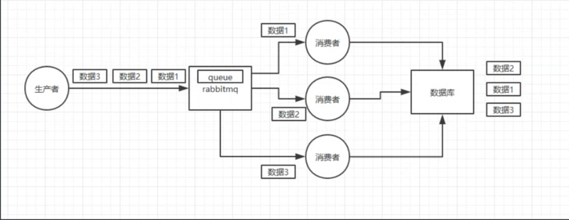

## 顺序消息
举个例子，我们以前做过一个 mysql binlog 同步的系统，压力还是非常大的，日同步数据
要达到上亿。mysql -＞ mysql，常见的一点在于说大数据 team，就需要同步一个 mysql 库过
来，对公司的业务系统的数据做各种复杂的操作。
你在 mysql 里增删改一条数据，对应出来了增删改3条binlog，接着这三条 binlog 发送到
MQ 里面，到消费出来依次执行，起码得保证按照顺序来的吧？不然执行顺序错了,就有很大的问题



我们希望是, 搞3个Queue，每个消费者就消费其中的一个Queue。**把需要保证顺序的数据发到1个Queue**里去


**Producer**
```go
RocketmqProducerClient, err = rocketmq.NewProducer(
    producer.WithQueueSelector(producer.NewManualQueueSelector()),
)

msg := &primitive.Message{
    Topic: _const.Topic,
    Body:  infoByte,
    Queue: &primitive.MessageQueue{
        Topic:      _const.Topic,
        BrokerName: _const.BrokerName,
        QueueId:    2,      // 向指定 queueId 中发送消息
    },
}

ctx := context.TODO()
err = RocketmqProducerClient.SendAsync(ctx, func(ctx context.Context, result *primitive.SendResult, err error) {
    if err != nil {
        fmt.Printf("!!!! Receive message error: %s\n", err)
    } else {
        fmt.Printf("!!! Send message success: result= %s\n", result.String())
    }
}, msg)
if err != nil {
    fmt.Printf("send data error: %s", err.Error())
    os.Exit(1) 
}
````
Consumer
```go
RocketmqPushConsumerClient, err = rocketmq.NewPushConsumer(
    consumer.WithNameServer(rocket.Host),
    consumer.WithConsumerModel(consumer.Clustering),
    consumer.WithGroupName("rocketTestTT"),

    //consumer.WithConsumerOrder(true), // 设置消费者局部消费有序
)
````