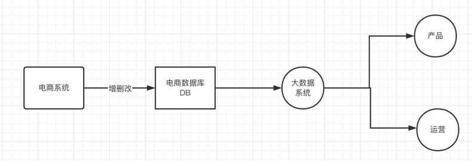
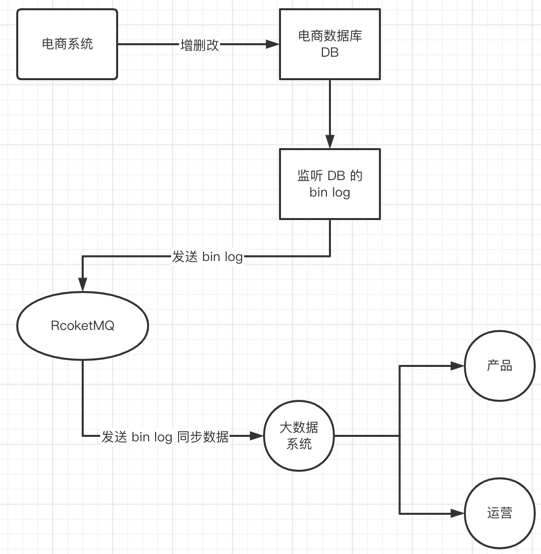

## 过滤消息
在电商系统中，运营和产品需要通过大数据系统来查询订单数据和商品数据



大数据直接查询DB，容易给 DB 增加cpu和 I/O 压力



通过大数据系统，将电商数据库 DB 通过监听 binLog 的方式同步，减轻 DB 压力，这里也使用到了 RocketMQ
（其实去掉RocketMQ后，也能正常把 DB 数据进行一个同步），引入RocketMQ, 方便了后续扩展，共享数据，新加入
同步功能只需要新增 Topic 即可


那么会产生一个问题，大数据系统中同步的数据种类繁多，有时候我们只需要 订单信息，而不需要商品信息，这个时候就需要对消息
进行一个过滤


**在RocketMQ中，一个消息都有且仅有一个标签，生产者发送消息时，消息都有一个标签。在消费者消息信息时，可以消费一个或多个标签的消息。**
### 1. 消息过滤语法
消息过滤共有两种方式
- tag 过滤
- sql 过滤

使用 sql 过滤遵循的是 SQL92语法：
````
RocketMQ只定义了一些基本语法来支持这个特性。你也可以很容易地 扩展它。

数值比较，比如：>, >=, ＜, ＜=, BETWEEN, =

字符比较，比如：=, <>, IN

IS NULL 或者 IS NOT NULL

逻辑符号 AND, OR, NOT

常量支持类型为：
 数值，比如：123, 3.1415;
 字符，比如：'abc'，必须用单引号包裹起来；
 NULL，特殊的常量
 布尔值，TRUE 或 FALSE
````
**使用注意：只有推模式的消费者可以使用SQL过滤。拉模式是用不了的。**

### 2. 使用 Tag 快速过滤消息
producer
```go
package main

import (
	"context"
	"fmt"
	"os"

	"github.com/apache/rocketmq-client-go/v2"
	"github.com/apache/rocketmq-client-go/v2/primitive"
	"github.com/apache/rocketmq-client-go/v2/producer"
)

func main() {
	p, _ := rocketmq.NewProducer(
		producer.WithNsResolver(primitive.NewPassthroughResolver([]string{"127.0.0.1:9876"})),
		producer.WithRetry(2),
	)
	err := p.Start()
	if err != nil {
		fmt.Printf("start producer error: %s", err.Error())
		os.Exit(1)
	}
	tags := []string{"TagA", "TagB", "TagC"}  
	for i := 0; i < 3; i++ {
		tag := tags[i%3]  // 三条消息 附带不同 tag
		msg := primitive.NewMessage("test",
			[]byte("Hello RocketMQ Go Client!"))
		msg.WithTag(tag)  // 设置 tag

		res, err := p.SendSync(context.Background(), msg)
		if err != nil {
			fmt.Printf("send message error: %s\n", err)
		} else {
			fmt.Printf("send message success: result=%s\n", res.String())
		}
	}
	err = p.Shutdown()
	if err != nil {
		fmt.Printf("shutdown producer error: %s", err.Error())
	}
}
````
consumer
```go
func main() {
	c, _ := rocketmq.NewPushConsumer(
		consumer.WithGroupName("testGroup"),
		consumer.WithNsResolver(primitive.NewPassthroughResolver([]string{"127.0.0.1:9876"})),
	)
	selector := consumer.MessageSelector{  // 设置 consumer 可消费的 tag 标签
		Type:       consumer.TAG,
		Expression: "TagA || TagC",  
	}
	err := c.Subscribe("TopicTest", selector, func(ctx context.Context,
		msgs ...*primitive.MessageExt) (consumer.ConsumeResult, error) {
		fmt.Printf("subscribe callback: %v \n", msgs)
		return consumer.ConsumeSuccess, nil
	})
	if err != nil {
		fmt.Println(err.Error())
	}
	err = c.Start()
	if err != nil {
		fmt.Println(err.Error())
		os.Exit(-1)
	}
	time.Sleep(time.Hour)
	err = c.Shutdown()
	if err != nil {
		fmt.Printf("shutdown Consumer error: %s", err.Error())
	}
}
````
### 3. 这个消息过滤是在Broker端进行的还是在Consumer端进的?
````
一种是在 brker 端

一种是在 consumer 端

那种更好一些呢？

1）假如在 broker 端进行，那么就是 broker 将消息过滤好，在发送给 consumer， 好处是减少了
网络的 I/O，减轻了 consumer 的压力，缺点就是 broker 过于繁忙

2）假如在 consumer 端进行，好处是减轻了 broker 的压力，缺点就是增加了网络的 I/O，consumer 过于繁忙

而 RocketMQ 选择的是 方式1
````
### ⚠️ 注意
如果碰到错误 ``CODE: 1  DESC: The broker does not support consumer to filter message by SQL92``

只需要在配置文件（broke.conf）中添加配置选项 ``enablePropertyFilter = true`` 即可

重启broker ``nohup sh bin/mqbroker -n localhost:9876 -c conf/broker.conf &``