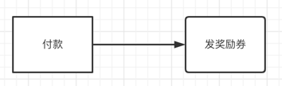
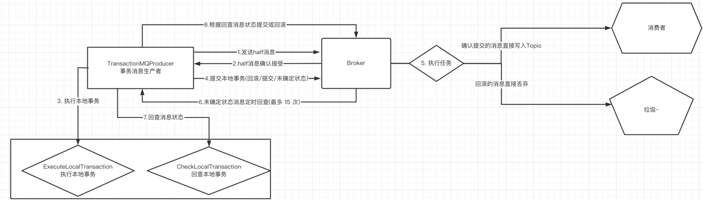
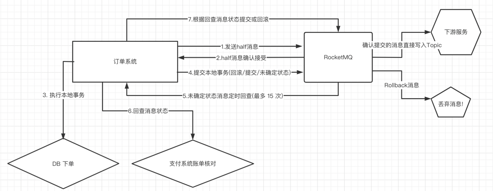

## 事务消息
> 首先明确什么是事务消息，官方定义：事务消息是在分布式系统中
保证最终一致性的两阶段提交的消息实现。他可以保证本地事务执行与消息发送两
个操作的原子性，也就是这两个操作一起成功或者一起失败。
>
> 其次，我们来理解下事务消息的编程模型。事务消息只保证消息发送者的本地事
务与发消息这两个操作的原子性，因此，事务消息的示例只涉及到消息发送者，对
于消息消费者来说，并没有什么特别的。
>
> 也就是说谈及 事务消息 主要涉及的就是 producer

### 应用场景
在电商场景里面，成功付款后，会发放优惠券



上面的场景：在电商系统中，会出现，付款成功后，准备发优惠券的时候，服务器宕机了。这个时候会造成用户成功付款，却没收到优惠券的情况。这种情况下，
我们很容易想到用事务来保证付款和发优惠券的原子性即可：要么付款和发优惠券同时成功，要么同时失败，是不允许其他一个成功，另一个失败的。

但上面，存在一种情况：付款和发优惠券高度耦合，这样子容易出现：发优惠券一直失败，会导致付款一直失败的场景。

对于这种场景的解决方案：引入消息中间件MQ来解耦(MQ崩溃的问题通过集群分布式来解决)
### 事务消息流程


消息状态：
```go
type LocalTransactionState int

const (
	CommitMessageState LocalTransactionState = iota + 1
	RollbackMessageState
	UnknowState
)
````
- 生产者发送half消息(half 对元消息进行了封装，对消费者是不可见的)
- MQ（broker）回复ACK确认消息（表示已经接收了消息）
- 执行本地事务（ExecuteLocalTransaction），如果 业务执行成功提交 Commit， 如果业务执行失败提交 ç，还有一些是未知 Unknow
- Broker 对消息状态进行区分， CommitMessageState 消息就可以投递给消费者消费了，RollbackMessageState 消息就可以直接丢弃了，
- Broker 对于 UnknowState 消息会定时回查，调用回查事务方法（CheckLocalTransaction），检测回查事务状态（回查次数的上限是 15 次）
- 根据消息的状态 Commit/Commit 进行对应的操作

**总结就是保证了 producer 到 broker 的过程结果的一致性**

### 实际场景


在每次下单后，记录在 DB 中，提交 MQ 的过程给所有订单一个 UnknowState 状态，通过回查来确定订单的状态，如果支付成功了
，那么订单给状态为 CommitMessageState，下游服务正常处理，如果没有支付成功，则继续为 UnknowState

### 流程源码分析
`NewTransactionProducer` 与 `NewProducer` 一样，默认调用就是 `NewDefaultProducer`
```go
func NewTransactionProducer(listener primitive.TransactionListener, opts ...producer.Option) (TransactionProducer, error) {
    return producer.NewTransactionProducer(listener, opts...)
}
````
```go
func NewTransactionProducer(listener primitive.TransactionListener, opts ...Option) (*transactionProducer, error) {
	producer, err := NewDefaultProducer(opts...)
	if err != nil {
		return nil, errors.Wrap(err, "NewDefaultProducer failed.")
	}
	return &transactionProducer{
		producer: producer,
		listener: listener,
	}, nil
}
````
```go
func NewDefaultProducer(opts ...Option) (*defaultProducer, error) {
	defaultOpts := defaultProducerOptions()  // 设置一些默认选贤
	for _, apply := range opts { // 将自定义选项赋值到 defaultOpts
		apply(&defaultOpts)
	}
	
	// ....
	
	return producer, nil
}
````
```go
func (tp *transactionProducer) SendMessageInTransaction(ctx context.Context, msg *primitive.Message) (*primitive.TransactionSendResult, error) {
    // 给待发送消息添加属性，表明是一个事务消息，即半消息，这里设置为true。(这个属性后面会用到)
	msg.WithProperty(primitive.PropertyTransactionPrepared, "true")
	msg.WithProperty(primitive.PropertyProducerGroup, tp.producer.options.GroupName)

	rsp, err := tp.producer.SendSync(ctx, msg)  // ！！！发送消息 
	if err != nil {
		return nil, err
	}
	localTransactionState := primitive.UnknowState
	switch rsp.Status {
    //消息发送成功
	case primitive.SendOK:
		if len(rsp.TransactionID) > 0 {
			msg.WithProperty("__transactionId__", rsp.TransactionID)
		}
		transactionId := msg.GetProperty(primitive.PropertyUniqueClientMessageIdKeyIndex)
		if len(transactionId) > 0 {
			msg.TransactionId = transactionId
		}
		localTransactionState = tp.listener.ExecuteLocalTransaction(msg) // 收到 ack 回复后调用
		if localTransactionState != primitive.CommitMessageState {
			rlog.Error("executeLocalTransaction but state unexpected", map[string]interface{}{
				"localState": localTransactionState,
				"message":    msg,
			})
		}

	case primitive.SendFlushDiskTimeout, primitive.SendFlushSlaveTimeout, primitive.SendSlaveNotAvailable:
		localTransactionState = primitive.RollbackMessageState
	default:
	}
    // 最后，给broker发送提交或者回滚事务的RPC请求
	tp.endTransaction(*rsp, err, localTransactionState)
    // 组装结果返回
	transactionSendResult := &primitive.TransactionSendResult{
		SendResult: rsp,
		State:      localTransactionState,
	}
	return transactionSendResult, nil
}
````
上述 `SendMessageInTransaction` 的大致流程
- 单的数据校验
- 给消息添加属性，表明这个事务消息
- 发送消息，且返回消息的结果--重点[1]
- 根据消息不同结果，进行不同的处理
- 如果消息发送成功，那么就执行本地事务(比如：执行本地事务-付款)，返回本地事务的结果--重点[2]
- 最后，根据本地事务的结果，给broker发送Commit或rollback的消息--重点[3]

#### 重点[1]
这是一个接口，核心方法为 `ExecuteLocalTransaction` && `CheckLocalTransaction`，一个是执行本地事务executeLocalTransaction。另一个是检查本地事务checkLocalTransaction。
这两个方法需要实现类去实现。

比如：执行本地事务-付款
```go
type TransactionListener interface {
	// 当发送事务性准备（一半）消息成功时，将调用此方法来执行本地事务
	ExecuteLocalTransaction(*Message) LocalTransactionState

	// 当没有回应时，准备（一半）信息, broker 将发送检查消息来检查交易状态，并且方法将被调用以获取本地事务状态。
	CheckLocalTransaction(*MessageExt) LocalTransactionState
}
````
#### 重点[2] 重点[3]
```go
func (tp *transactionProducer) endTransaction(result primitive.SendResult, err error, state primitive.LocalTransactionState) error {
	var msgID *primitive.MessageID
	if len(result.OffsetMsgID) > 0 {
		msgID, _ = primitive.UnmarshalMsgID([]byte(result.OffsetMsgID))
	} else {
		msgID, _ = primitive.UnmarshalMsgID([]byte(result.MsgID))
	}
	// 估计没有反序列化回来
	brokerAddr := tp.producer.options.Namesrv.FindBrokerAddrByName(result.MessageQueue.BrokerName)
	requestHeader := &internal.EndTransactionRequestHeader{
		TransactionId:        result.TransactionID,
		CommitLogOffset:      msgID.Offset,
		ProducerGroup:        tp.producer.group,
		TranStateTableOffset: result.QueueOffset,
		MsgID:                result.MsgID,
		CommitOrRollback:     tp.transactionState(state),   // 根据事务消息和本地事务的执行结果，发送不同的结果给broker 
	}

	req := remote.NewRemotingCommand(internal.ReqENDTransaction, requestHeader, nil)
	req.Remark = tp.errRemark(err)

	return tp.producer.client.InvokeOneWay(context.Background(), brokerAddr, req, tp.producer.options.SendMsgTimeout)
}
func (tp *transactionProducer) errRemark(err error) string {
    if err != nil {
        return "executeLocalTransactionBranch exception: " + err.Error()
    }
    return ""
}
func (tp *transactionProducer) transactionState(state primitive.LocalTransactionState) int {
    switch state {
        case primitive.CommitMessageState:
            return primitive.TransactionCommitType
        case primitive.RollbackMessageState:
            return primitive.TransactionRollbackType
        case primitive.UnknowState:
            return primitive.TransactionNotType
        default:
            return primitive.TransactionNotType
    }
}
````
到这个时候，我们已经把消息从生产者发送到了broker里面。 那接下来，我们就需要了解broker是如何处理事务消息的
那就痛苦的撸撸 java 源码吧

#### 事务消息如何回查
直接看代码注解即可
TransactionalMessageCheckService#onWaitEnd
```java
@Override
protected void onWaitEnd() {
    //timeout是从broker配置文件中获取transactionTimeOut值，代表事务的过期时间，(一个消息的存储时间 + timeout) > 系统当前时间，才会对该消息执行事务状态会查
    long timeout = brokerController.getBrokerConfig().getTransactionTimeOut();
    //checkMax是从broker配置文件中获取transactionCheckMax值，代表事务的最大检测次数，如果超过检测次数，消息会默认为丢弃，即rollback消息
    int checkMax = brokerController.getBrokerConfig().getTransactionCheckMax();
    long begin = System.currentTimeMillis();
    log.info("Begin to check prepare message, begin time:{}", begin);
    //回查：核心点org.apache.rocketmq.broker.transaction.queue.TransactionalMessageServiceImpl.check
    this.brokerController.getTransactionalMessageService().check(timeout, checkMax, this.brokerController.getTransactionalMessageCheckListener());
    log.info("End to check prepare message, consumed time:{}", System.currentTimeMillis() - begin);
}
````
进入check方法：TransactionalMessageServiceImpl#check
```java
@Override
    public void check(long transactionTimeout, int transactionCheckMax,
        AbstractTransactionalMessageCheckListener listener) {
        try {
            //RMQ_SYS_TRANS_HALF_TOPIC主题
            String topic = TopicValidator.RMQ_SYS_TRANS_HALF_TOPIC;
            //获取RMQ_SYS_TRANS_HALF_TOPIC主题下的所有队列
            Set<MessageQueue> msgQueues = transactionalMessageBridge.fetchMessageQueues(topic);
            //数据校验
            if (msgQueues == null || msgQueues.size() == 0) {
                log.warn("The queue of topic is empty :" + topic);
                return;
            }
            log.debug("Check topic={}, queues={}", topic, msgQueues);
            //遍历队列
            for (MessageQueue messageQueue : msgQueues) {
                long startTime = System.currentTimeMillis();
                //根据队列获取对应topic:RMQ_SYS_TRANS_OP_HALF_TOPIC下的opQueue
                //RMQ_SYS_TRANS_HALF_TOPIC：prepare消息的主题，事务消息首先先进入到该主题。
                //RMQ_SYS_TRANS_OP_HALF_TOPIC：当消息服务器收到事务消息的提交或回滚请求后，会将消息存储在该主题下
                MessageQueue opQueue = getOpQueue(messageQueue);
                //messageQueue队列的偏移量
                long halfOffset = transactionalMessageBridge.fetchConsumeOffset(messageQueue);
                //opQueue队列的偏移量
                long opOffset = transactionalMessageBridge.fetchConsumeOffset(opQueue);

                log.info("Before check, the queue={} msgOffset={} opOffset={}", messageQueue, halfOffset, opOffset);
                //如果其中一个队列的偏移量小于0，就跳过
                if (halfOffset < 0 || opOffset < 0) {
                    log.error("MessageQueue: {} illegal offset read: {}, op offset: {},skip this queue", messageQueue,
                        halfOffset, opOffset);
                    continue;
                }
                //doneOpOffset和removeMap主要的目的是避免重复调用事务回查接口
                List<Long> doneOpOffset = new ArrayList<>();
                HashMap<Long, Long> removeMap = new HashMap<>();
                PullResult pullResult = fillOpRemoveMap(removeMap, opQueue, opOffset, halfOffset, doneOpOffset);
                if (null == pullResult) {
                    log.error("The queue={} check msgOffset={} with opOffset={} failed, pullResult is null",
                    messageQueue, halfOffset, opOffset);
                    continue;
                }
                // single thread
                //空消息的次数
                int getMessageNullCount = 1;
                //RMQ_SYS_TRANS_HALF_TOPIC#queueId的最新偏移量
                long newOffset = halfOffset;
                //RMQ_SYS_TRANS_HALF_TOPIC的偏移量
                long i = halfOffset;
                while (true) {
                    //限制每次最多处理的时间是60s
                    if (System.currentTimeMillis() - startTime > MAX_PROCESS_TIME_LIMIT) {
                        log.info("Queue={} process time reach max={}", messageQueue, MAX_PROCESS_TIME_LIMIT);
                        break;
                    }
                    //removeMap包含当前信息，则跳过，处理下一条信息
                    //removeMap的信息填充是在上面的fillOpRemoveMap
                    //fillOpRemoveMap具体逻辑是：具体实现逻辑是从RMQ_SYS_TRANS_OP_HALF_TOPIC主题中拉取32条，
                    //如果拉取的消息队列偏移量大于等于RMQ_SYS_TRANS_HALF_TOPIC#queueId当前的处理进度时
                    //会添加到removeMap中，表示已处理过
                    if (removeMap.containsKey(i)) {
                        log.info("Half offset {} has been committed/rolled back", i);
                        Long removedOpOffset = removeMap.remove(i);
                        doneOpOffset.add(removedOpOffset);
                    } else {
                        //根据消息队列偏移量i从RMQ_SYS_TRANS_HALF_TOPIC队列中获取消息
                        GetResult getResult = getHalfMsg(messageQueue, i);
                        MessageExt msgExt = getResult.getMsg();
                        //如果消息为空
                        if (msgExt == null) {
                            //则根据允许重复次数进行操作，默认重试一次  MAX_RETRY_COUNT_WHEN_HALF_NULL=1
                            //如果超过重试次数，直接跳出while循环，结束该消息队列的事务状态回查
                            if (getMessageNullCount++ > MAX_RETRY_COUNT_WHEN_HALF_NULL) {
                                break;
                            }
                            //如果是由于没有新的消息而返回为空（拉取状态为：PullStatus.NO_NEW_MSG），则结束该消息队列的事务状态回查。
                            if (getResult.getPullResult().getPullStatus() == PullStatus.NO_NEW_MSG) {
                                log.debug("No new msg, the miss offset={} in={}, continue check={}, pull result={}", i,
                                    messageQueue, getMessageNullCount, getResult.getPullResult());
                                break;
                            } else {
                                log.info("Illegal offset, the miss offset={} in={}, continue check={}, pull result={}",
                                    i, messageQueue, getMessageNullCount, getResult.getPullResult());
                                //其他原因，则将偏移量i设置为：getResult.getPullResult().getNextBeginOffset()，重新拉取
                                i = getResult.getPullResult().getNextBeginOffset();
                                newOffset = i;
                                continue;
                            }
                        }
                        //判断该消息是否需要discard(吞没，丢弃，不处理)、或skip(跳过)
                        //needDiscard 依据：如果该消息回查的次数超过允许的最大回查次数，
                        // 则该消息将被丢弃，即事务消息提交失败，不能被消费者消费，其做法，
                        // 主要是每回查一次，在消息属性TRANSACTION_CHECK_TIMES中增1，默认最大回查次数为5次。

                        //needSkip依据：如果事务消息超过文件的过期时间，
                        // 默认72小时（具体请查看RocketMQ过期文件相关内容），则跳过该消息。
                        if (needDiscard(msgExt, transactionCheckMax) || needSkip(msgExt)) {
                            listener.resolveDiscardMsg(msgExt);
                            newOffset = i + 1;
                            i++;
                            continue;
                        }
                        //消息的存储时间大于开始时间，中断while循环
                        if (msgExt.getStoreTimestamp() >= startTime) {
                            log.debug("Fresh stored. the miss offset={}, check it later, store={}", i,
                                new Date(msgExt.getStoreTimestamp()));
                            break;
                        }
                        //该消息已存储的时间=系统当前时间-消息存储的时间戳
                        long valueOfCurrentMinusBorn = System.currentTimeMillis() - msgExt.getBornTimestamp();
                        //checkImmunityTime：检测事务的时间
                        //transactionTimeout:事务消息的超时时间
                        long checkImmunityTime = transactionTimeout;
                        //用户设定的checkImmunityTimeStr
                        String checkImmunityTimeStr = msgExt.getUserProperty(MessageConst.PROPERTY_CHECK_IMMUNITY_TIME_IN_SECONDS);
                        if (null != checkImmunityTimeStr) {
                            //checkImmunityTime=Long.valueOf(checkImmunityTimeStr)
                            checkImmunityTime = getImmunityTime(checkImmunityTimeStr, transactionTimeout);
                            if (valueOfCurrentMinusBorn < checkImmunityTime) {
                                if (checkPrepareQueueOffset(removeMap, doneOpOffset, msgExt)) {
                                    //最近进度=当前消息进度+1
                                    newOffset = i + 1;
                                    i++;
                                    continue;
                                }
                            }
                        } else {//如果当前时间小于事务超时时间，则结束while循环
                            if ((0 <= valueOfCurrentMinusBorn) && (valueOfCurrentMinusBorn < checkImmunityTime)) {
                                log.debug("New arrived, the miss offset={}, check it later checkImmunity={}, born={}", i,
                                    checkImmunityTime, new Date(msgExt.getBornTimestamp()));
                                break;
                            }
                        }
                        List<MessageExt> opMsg = pullResult.getMsgFoundList();
                        //是否需要回查，判断依据如下：
                        //消息已存储的时间大于事务超时时间
                        boolean isNeedCheck = (opMsg == null && valueOfCurrentMinusBorn > checkImmunityTime)
                            || (opMsg != null && (opMsg.get(opMsg.size() - 1).getBornTimestamp() - startTime > transactionTimeout))
                            || (valueOfCurrentMinusBorn <= -1);

                        if (isNeedCheck) {
                            if (!putBackHalfMsgQueue(msgExt, i)) {//11
                                continue;
                            }
                            //重点：进行事务回查(异步)
                            listener.resolveHalfMsg(msgExt);
                        } else {
                            //加载已处理的消息进行筛选
                            pullResult = fillOpRemoveMap(removeMap, opQueue, pullResult.getNextBeginOffset(), halfOffset, doneOpOffset);
                            log.debug("The miss offset:{} in messageQueue:{} need to get more opMsg, result is:{}", i,
                                messageQueue, pullResult);
                            continue;
                        }
                    }
                    newOffset = i + 1;
                    i++;
                }
                //保存half消息队列的回查进度
                if (newOffset != halfOffset) {
                    transactionalMessageBridge.updateConsumeOffset(messageQueue, newOffset);
                }
                long newOpOffset = calculateOpOffset(doneOpOffset, opOffset);
                //保存处理队列opQueue的处理今夕
                if (newOpOffset != opOffset) {
                    transactionalMessageBridge.updateConsumeOffset(opQueue, newOpOffset);
                }
            }
        } catch (Throwable e) {
            log.error("Check error", e);
        }

    }
````
resolveHalfMsg
````
public void resolveHalfMsg(final MessageExt msgExt) {
        executorService.execute(new Runnable() {
            @Override
            public void run() {
                try {
                    //针对每个待反查的half消息，进行回查本地事务结果
                    sendCheckMessage(msgExt);
                } catch (Exception e) {
                    LOGGER.error("Send check message error!", e);
                }
            }
        });
    }
````
sendCheckMessage(msgExt)
````
    /**
     * 发送回查消息
     * @param msgExt
     * @throws Exception
     */
    public void sendCheckMessage(MessageExt msgExt) throws Exception {
        CheckTransactionStateRequestHeader checkTransactionStateRequestHeader = new CheckTransactionStateRequestHeader();
        checkTransactionStateRequestHeader.setCommitLogOffset(msgExt.getCommitLogOffset());
        checkTransactionStateRequestHeader.setOffsetMsgId(msgExt.getMsgId());
        checkTransactionStateRequestHeader.setMsgId(msgExt.getUserProperty(MessageConst.PROPERTY_UNIQ_CLIENT_MESSAGE_ID_KEYIDX));
        checkTransactionStateRequestHeader.setTransactionId(checkTransactionStateRequestHeader.getMsgId());
        checkTransactionStateRequestHeader.setTranStateTableOffset(msgExt.getQueueOffset());
        //原主题
        msgExt.setTopic(msgExt.getUserProperty(MessageConst.PROPERTY_REAL_TOPIC));
        //原队列id
        msgExt.setQueueId(Integer.parseInt(msgExt.getUserProperty(MessageConst.PROPERTY_REAL_QUEUE_ID)));

        msgExt.setStoreSize(0);
        String groupId = msgExt.getProperty(MessageConst.PROPERTY_PRODUCER_GROUP);
        Channel channel = brokerController.getProducerManager().getAvailableChannel(groupId);
        if (channel != null) {
            //回调查询本地事务状态
            brokerController.getBroker2Client().checkProducerTransactionState(groupId, channel, checkTransactionStateRequestHeader, msgExt);
        } else {
            LOGGER.warn("Check transaction failed, channel is null. groupId={}", groupId);
        }
    }
````