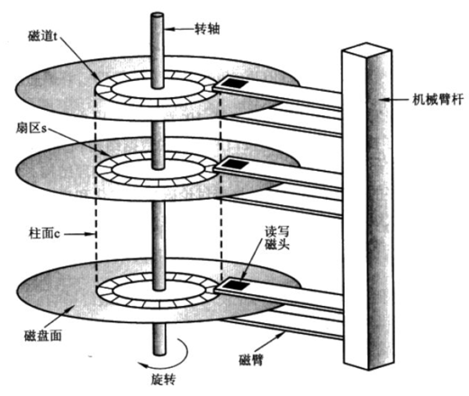
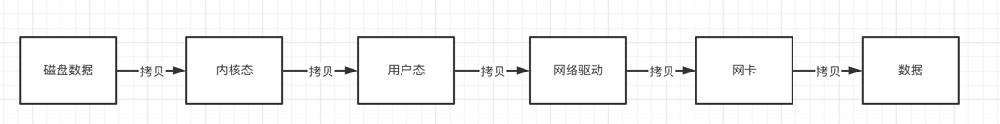
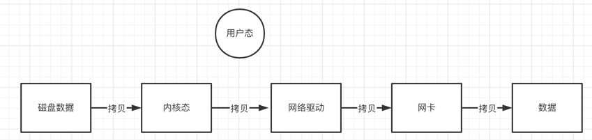

## 存储机制
存储机制大致分为 读 & 写
### 随机IO 和 顺序IO
对于从磁盘中读取和写入数据的操作，叫做磁盘IO，分两种情况：
- 随机IO就是读写的内容分散在磁盘的不同位置，需要来回查找所以效率低；
- 顺序IO就是读写的内容集中存储在磁盘的一块（本次 I/O 给出的初始扇区地址和上一次 I/O 的结束扇区地址是完全连续），从前到后依次读取，免去了查找的过程，所以效率高。

机械磁盘的顺序IO和随机IO的性能差异巨大。
- 顺序IO比随机IO效率高的原因是：在做连续IO的时候，磁头几乎不用换道，或者换道的时间很短
- 随机IO不停寻址，如果这个IO很多的话，会导致磁头不停地换道，造成效率的极大降低。

### 写
写的方式：
- 顺序写
- 随机写

**RocketMQ是基于顺序写的, 这是RocketMQ为什么写得快的原因之一**
### 读
读一般都是随机读，提到随机读无非关联的问题就是提高读取的效率，比如 添加索引 零拷贝 使用优秀的数据结构组合....

**RocketMQ进行读取数据时，用的是零拷贝。**

#### 那么什么是零拷贝呢？
普通的数据拷贝过程（简略版）

零拷贝的优化（通过mmap的方式，可以省去向用户态复制数据，从而提高读取数据的速度）

### RocketMQ的存储结构
- CommitLog是存储消息的文件，大小为1G，顺序写
- ComsumeQueue：是CommitLog的索引文件，里面存储的是消息的偏移量，也就是索引，用于读取消息。随机读
- IndexFile:索引文件，用于读取不同时间区间或key的消息